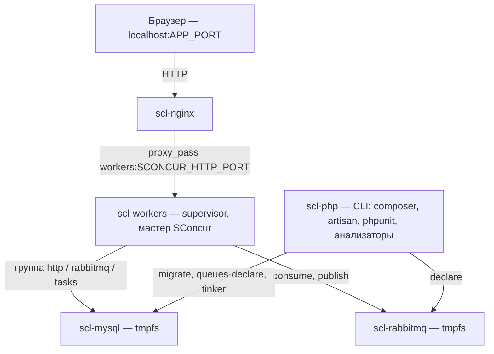

# Шаг 2. Docker-окружение

Пять контейнеров. Префикс имён — `scl-` (у `sconcur-php` — `sc-`, у `slogger.back` —
`sl-`, у `slogger.laravel` — `sll-`; занятые префиксы не переиспользуем, чтобы проекты
могли работать одновременно).



## 2.1 `docker/php/Dockerfile`

Multi-stage, по образцу `slogger.back/docker/php/Dockerfile`, но от `php:8.4.15-cli`
(fpm не нужен — HTTP отдаёт сам SConcur).

**Стадия `php_base`:**

- `apt-get install`: `git`, `curl`, `jq`, `zip`, `unzip`, `wget`, `libzip-dev`,
  `libssl-dev`, `libcurl4-openssl-dev`, `librabbitmq-dev`, `pkg-config`.
- PIE (`https://github.com/php/pie/releases/latest/download/pie.phar`).
- `pie install msgpack/msgpack-php:3.0.1` — обязателен: через msgpack ходит весь
  обмен PHP↔Go (`sconcur/sconcur` требует `ext-msgpack: 3.0.1`).
- `docker-php-ext-install pdo pdo_mysql bcmath sockets pcntl zip` — `pcntl` нужен
  мастеру и всем долгоживущим воркерам, `pdo_mysql` — соединению `mysql` (с которым
  сравнивается `sconcur_mysql`).
- `sconcur.so`: `COPY composer.lock ./`, затем `jq -r '.packages[] |
  select(.name=="sconcur/sconcur") | .version'`, скачивание
  `https://github.com/sprust/sconcur/releases/download/v${version}/sconcur.so` в
  `$(php-config --extension-dir)` и `echo "extension=sconcur.so" >
  /usr/local/etc/php/conf.d/docker-php-ext-sconcur.ini`. Слово в слово как в
  `slogger.back`, включая retry-флаги curl.
  **Контекст сборки — корень репозитория** (`context: .`,
  `dockerfile: docker/php/Dockerfile`), иначе `composer.lock` не виден.

**Стадия `php_cli`** (наследует `php_base`):

- composer из `getcomposer.org/installer`.
- `git config --global --add safe.directory /app` (репозиторий примонтирован, владелец
  на хосте другой — как в `slogger.laravel`).
- Создание пользователя по `USER_ID`/`GROUP_ID`, `USER "$USER_ID"`.

**Стадия `php_workers`** (наследует `php_base`):

- `apt-get install supervisor`, `chmod 777 -R /var/log/supervisor`.
- Тот же блок с пользователем.

Расширение включено глобально (`conf.d`), поэтому ни `make test`, ни демо не должны
подставлять `-d extension=...` — в отличие от `sconcur-php`, где `.so` собирается
локально и подключается флагом.

## 2.2 `docker-compose.yml`

```yaml
services:
  nginx:      # scl-nginx,  ports: ${APP_PORT:-48081}:80
  php:        # scl-php,    CLI, бесконечный sleep-loop как команда
  workers:    # scl-workers, command: supervisord -n, ports: панель телеметрии
  mysql:      # scl-mysql,  tmpfs
  rabbitmq:   # scl-rabbitmq, tmpfs
```

Детали:

- **nginx**: `image: nginx:alpine`, `depends_on: [workers]`, переменная окружения
  `SCONCUR_HTTP_PORT` подставляется в шаблон при старте, том
  `./docker/nginx/templates:/etc/nginx/templates`. Публикуется единственный порт,
  который нужен пользователю: `${APP_PORT:-48081}:80`.
- **php**: стадия `php_cli`, `working_dir: /app`, том `./:/app`,
  `command` — бесконечный цикл ожидания (как `php` в `sconcur-php` и
  `docker-php-stub.php` в `slogger.laravel`; берём вариант `sconcur-php` — он короче и
  не тянет отдельный файл), `extra_hosts: host.docker.internal:host-gateway`.
  `depends_on` на mysql и rabbitmq по `service_healthy`.
- **workers**: стадия `php_workers`, том `./:/app` плюс
  `./docker/supervisor/conf/supervisor.conf:/etc/supervisor/conf.d/supervisord.conf` и
  `./docker/php/conf/php-workers.ini:/usr/local/etc/php/conf.d/docker.ini`.
  Публикуем панель телеметрии: `${SCONCUR_PANEL_DOCKER_PORT:-38081}:${SCONCUR_PANEL_PORT:-28081}`.
  HTTP-порт (`28080`) наружу **не** публикуется — снаружи в него ходит только nginx.
  `depends_on` на mysql и rabbitmq по `service_healthy`.
- **mysql**: `mysql:8.4` (как в `sconcur-php`), healthcheck `mysqladmin ping`, `tmpfs:
  /var/lib/mysql:rw,noexec,nosuid,size=512m`, рядом закомментированный именованный том.
  Порт наружу — `${DB_DOCKER_PORT:-33306}:3306`.
- **rabbitmq**: `rabbitmq:4.1-management`, healthcheck `rabbitmq-diagnostics -q ping`,
  `tmpfs: /var/lib/rabbitmq:rw,noexec,nosuid,size=256m`, порты
  `${RABBITMQ_DOCKER_PORT:-35673}:5672` и
  `${RABBITMQ_MANAGEMENT_DOCKER_PORT:-45672}:15672`.

Комментарий про in-memory режим — тот же по смыслу, что в `sconcur-php`: состояние
живёт в tmpfs, стирается при пересоздании контейнера; чтобы получить диск, надо
закомментировать `tmpfs` и раскомментировать тома и секцию `volumes:`.

## 2.3 `docker/nginx/templates/default.conf.template`

Копия из `slogger.back` с сохранением её комментария про `resolver 127.0.0.11` и
разрешение апстрима через переменную (иначе после пересоздания `workers` nginx
продолжает стучаться на старый IP). Меняется только `set $sconcur workers:${SCONCUR_HTTP_PORT};`
и таймауты можно оставить дефолтные (демо не строит деревья трейсов) —
`proxy_read_timeout 60s`.

## 2.4 `docker/supervisor/conf/supervisor.conf`

По образцу `slogger.back`, одна программа:

```ini
[program:scl-sconcur-master]
command=php /app/demo/artisan sconcur:servers:master:start
autostart=true
autorestart=true
startsecs=0
stopsignal=TERM
; Мастер пересылает SIGTERM своим группам и ждёт их shutdownTimeoutMs — до 30 с
; для пула задач. Дефолтные 10 с супервизора убили бы мастера посреди дренажа.
stopwaitsecs=40
stdout_logfile=/var/log/supervisor/scl-sconcur-master-out.log
stderr_logfile=/var/log/supervisor/scl-sconcur-master-err.log
```

`[unix_http_server] file=/tmp/supervisor.sock` — как в `slogger.back`.

## 2.5 `docker/php/conf/`

- `php.ini` — `memory_limit=256M` для CLI-контейнера.
- `php-workers.ini` — `memory_limit=512M` (как в `slogger.back`).

## 2.6 `.env.example`

```dotenv
# Docker user and group IDs (root by default).
# On Linux find yours with `id -u` and `id -g`.
DOCKER_USER_ID=0
DOCKER_GROUP_ID=0

# demo app
APP_PORT=48081
APP_ENV=local
APP_DEBUG=true
APP_KEY=

# sconcur http server (внутри сети docker; наружу ходит только nginx)
SCONCUR_HTTP_ADDRESS=0.0.0.0:28080
SCONCUR_HTTP_PORT=28080
SCONCUR_HTTP_WORKER_COUNT=2
SCONCUR_PANEL_PORT=28081
SCONCUR_PANEL_DOCKER_PORT=38081
SCONCUR_HTTP_ADMIN_TOKEN=_scl_admin_token_

# sconcur rabbitmq consumer pool
SCONCUR_RABBITMQ_WORKER_COUNT=1
SCONCUR_RABBITMQ_QUEUE=demo
SCONCUR_RABBITMQ_QUEUE_CONSUMERS=4

# mysql
DB_HOST=scl-mysql
DB_PORT=3306
DB_DATABASE=demo
DB_USERNAME=scl_user
DB_PASSWORD=_scl_password_567
DB_ROOT_PASSWORD=_scl_root_password_567
DB_DOCKER_PORT=33306

# rabbitmq
RABBITMQ_HOST=scl-rabbitmq
RABBITMQ_PORT=5672
RABBITMQ_USER=scl_user
RABBITMQ_PASSWORD=_scl_password_567
RABBITMQ_VHOST=/
RABBITMQ_DOCKER_PORT=35673
RABBITMQ_MANAGEMENT_DOCKER_PORT=45672
```

Имена переменных для HTTP-сервера и пула консьюмеров берём **ровно те, что читает
`config/sconcur.php`** — список сверен с таблицами ENV в `README.md`. В `.env.example`
кладём только то, что реально меняют; остальное остаётся на пакетных дефолтах.

`SCONCUR_PANEL_HOST` для демо будет `http://127.0.0.1:${SCONCUR_PANEL_PORT}/api/stats`
изнутри контейнера `workers`; для страницы демо панель дёргается сервером, не браузером.

## Проверка шага

```bash
make env-copy
make build
make up
docker compose ps          # все healthy
docker compose exec php php -m | grep -E 'sconcur|msgpack'
```
