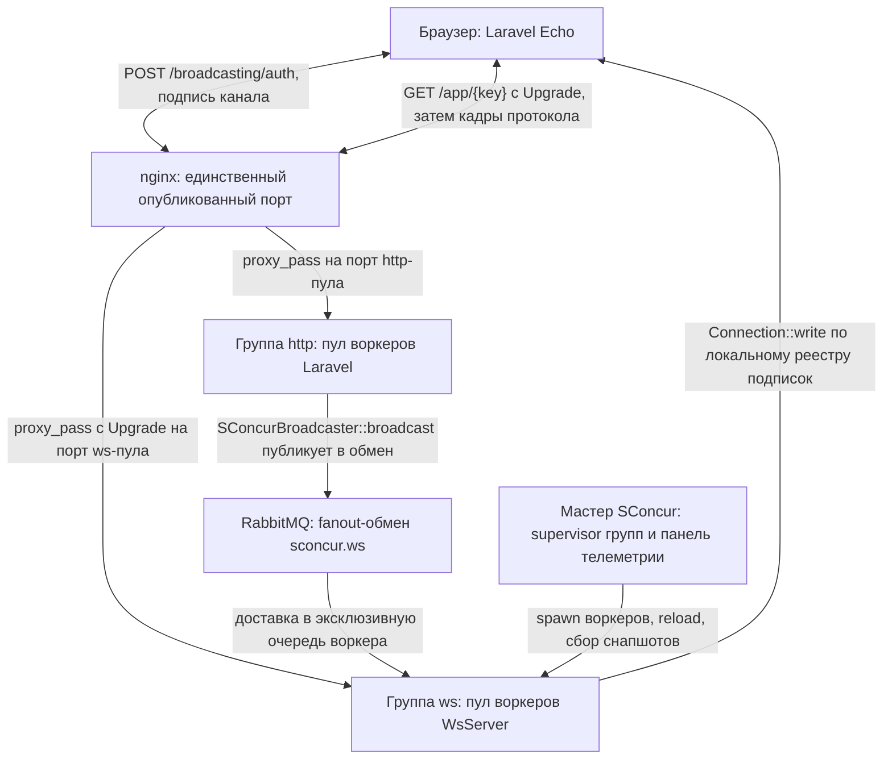
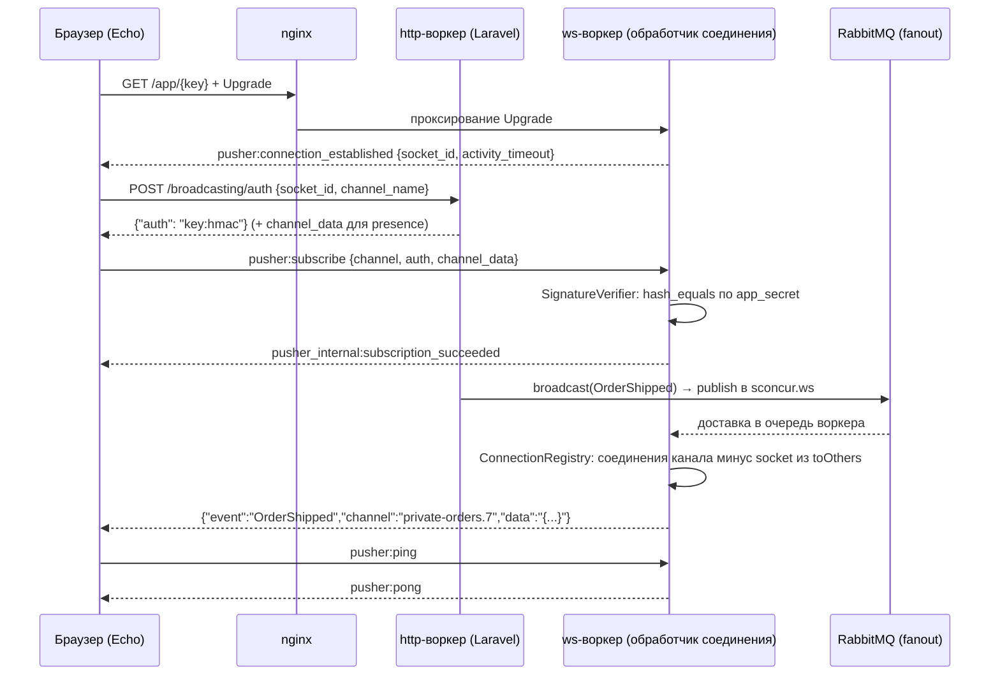

# WebSocket-сервер: четвёртая среда выполнения пакета

Цель — добавить в `sconcur/laravel` пул WebSocket-воркеров рядом с http-пулом,
rabbitmq-пулом и пулом периодических задач: тот же мастер, тот же
`config/sconcur.php`, та же телеметрия. Со стороны приложения это должно быть
обычное Laravel-вещание (`broadcast(new OrderShipped($order))`), а со стороны
браузера — обычный Laravel Echo без своего клиента и без своего SDK.

## Что даёт библиотека

`SConcur\Features\WsServer\WsServer` — долгоживущий сервер: слушатель и HTTP-Upgrade
живут в расширении, каждое поднятое соединение отдаётся в PHP и обслуживается в
своей корутине. Обработчик — `Closure(Connection): void`; когда он возвращается,
соединение закрывается.

`Connection` даёт `read()`, `write($data, $binary)`, `close()`, `isClosed()`,
`lastMessageWasBinary()` и поля `id`, `remoteAddr`, `localAddr`, `path`,
`subprotocol`. Подробности — `vendor/sconcur/sconcur/docs/websocket-server.md`.

Чего библиотека не даёт и что придётся написать здесь:

| Не даёт | Почему это наша задача |
|---|---|
| Рассылку между соединениями | `write` маршрутизируется расширением по `id` и только внутри своего процесса |
| Любую доставку между процессами | http-воркер и ws-воркер — разные процессы одного мастера |
| Прикладной протокол | после Upgrade это просто поток сообщений |
| Каналы, подписки, авторизацию | то же самое |
| HTTP-маршруты на том же порту | всё, что не Upgrade, получает `426`, чужой `path` — `404` |

## Ключевые решения

1. **Протокол — совместимое подмножество Pusher (v7).** Тогда `laravel-echo`
   работает без своего клиента, а авторизация канала идёт через уже существующий
   маршрут приложения `/broadcasting/auth`. Так же поступают Reverb, soketi и
   laravel-websockets. Детали — `01-protocol.md`.

2. **Приложение → ws-пул идёт через шину, а не через HTTP.** У Reverb приложение
   публикует событие HTTP-запросом в сам сервер (`POST /apps/{id}/events`). Здесь так
   нельзя: ws-сервер не обслуживает прикладных маршрутов, а под `SO_REUSEPORT` у
   отдельного воркера пула вообще нет своего адреса — ядро само раздаёт соединения.
   Поэтому доставка — fanout-обмен RabbitMQ: каждый ws-воркер держит свою
   эксклюзивную очередь и раскладывает пришедшее сообщение по своим соединениям.
   Детали — `03-bus-and-broadcasting.md`.

3. **В ws-процессе нет ни базы, ни сессии, ни Laravel-авторизации.** Подписка
   проверяется подписью HMAC, которую выдал http-воркер. Ws-воркер — это
   маршрутизатор сообщений, и держать в нём соединение к БД на каждое подключение
   незачем.

4. **Presence-каналы выносятся в отдельный этап.** Список участников канала при
   нескольких воркерах пула становится распределённым состоянием — это самая
   дорогая часть задачи, и она не должна задерживать всё остальное.
   Детали — `04-presence.md`.

## Топология

Rabbitmq-пул и пул задач публикуют в ту же шину тем же `SConcurBroadcaster` —
на схеме опущены, чтобы не дублировать одну и ту же стрелку трижды.

## Жизненный цикл одного клиента

## Состав плана

| Файл | О чём |
|---|---|
| `01-protocol.md` | кадры протокола, каналы, авторизация подписи, коды ошибок |
| `02-runtime.md` | группа `ws`, команда, runner, реестр соединений, корутина шины, graceful stop |
| `03-bus-and-broadcasting.md` | шина, `SConcurBroadcaster`, `toOthers`, клиентские события |
| `04-presence.md` | presence-каналы и распределённый список участников |
| `05-config-and-infra.md` | `config/sconcur.php`, ENV, nginx, docker, демо-страница |
| `06-tests-and-docs.md` | тесты, `docs/`, обе версии README |
| `07-stages.md` | порядок работ и что считается готовым |
| `08-spike.md` | результаты этапа 0: что проверено на живом рантайме и что из-за этого изменилось |
