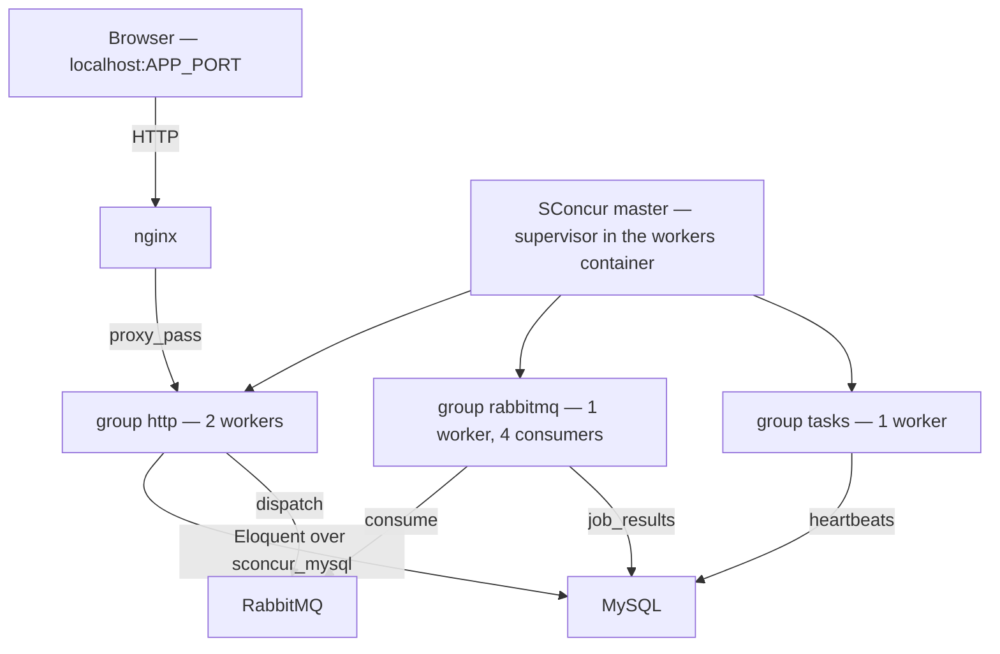

# Demo application

A minimal Laravel application the SConcur master serves, so the package can be seen
working rather than only read about. `make setup` brings it up on
`http://localhost:${APP_PORT}` (48081 by default).

It is not the test workbench. `workbench/` runs under `orchestra/testbench` and belongs
to the test suite; this one carries its own `bootstrap/app.php` because it needs the
application to be a `SConcur\Laravel\Foundation\AsyncApplication`, and testbench builds
`Illuminate\Foundation\Application` itself.

Nothing is installed here: `demo/vendor` is a symlink to the repository's own `vendor`,
and the classes are autoloaded through the root `composer.json` (`Demo\App\` →
`demo/app/`). One install, one lock, no way for the package and the application
demonstrating it to drift apart. The `composer.json` in this directory is never
installed from — Laravel reads the one at its base path (`Application::getNamespace()`
does so without checking that it exists, so a missing file turns every error page into
a different error), and this is that file.

## What runs where



All three groups are pools of one master, configured in `demo/config/sconcur.php`.
The master's telemetry panel is what the page's top section reads.

## State after a restart

MySQL and RabbitMQ keep their data in tmpfs, so stopping either container leaves the
schema and the queue gone. The workers container migrates and declares from its
entrypoint before starting the master, so a restart repairs itself — both commands are
idempotent, and a failure there is reported without keeping the container down. To do it
by hand: `make demo-reset`.

## Endpoints

| Endpoint | What it shows |
|---|---|
| `GET /` | the page: telemetry, and a control for each of the sections below |
| `GET /api/health` | liveness; `make setup` and CI check this one |
| `GET /api/concurrent?n=10&ms=200` | N cooperative pauses as coroutines of one `WaitGroup`, then the same N one after another. The concurrent leg takes about `ms`, the sequential one `n × ms` — same process, same thread |
| `GET /api/notes` / `POST /api/notes` | Eloquent over the `sconcur_mysql` connection |
| `POST /api/notes/bulk` | N inserts as coroutines, each in a transaction of its own — which holds on this connection because the nesting level is per coroutine and the Go side pins each transaction to a physical connection |
| `POST /api/jobs` | dispatches `DemoJob` to RabbitMQ over the `sconcur_rabbitmq` driver |
| `GET /api/jobs` | what the consumer pool did with them, plus the `failed_jobs` count |
| `GET /api/heartbeats` | the counter the periodic task pool bumps |
| `GET /api/scaling` / `POST /api/scaling` | how many processes each pool runs and how many consumers the queue gets in each; a change rolls only the groups it affects |
| `GET /api/telemetry` | the master's panel, folded into what the page draws |

The sequential leg of `/api/concurrent` is skipped when `n × ms` would exceed 3 s: it
would really take that long, and a number nobody measured does not belong beside one
somebody did.

## Changing the pool sizes

The **Pool sizes** panel writes the numbers to `demo/storage/app/scaling.json`, which
`demo/config/sconcur.php` reads while it builds the master config, and asks for the
affected groups to be rolled. The roll itself is done by `ScalingTask` in the periodic
task pool, not by the request and not by a queued job:

- reload waits for the roll to finish. An HTTP worker calling it would still be inside
  that wait when its own turn to be replaced came — the server waiting for the handler
  to drain, the handler waiting for the master — and the standoff ends at
  `shutdownTimeoutMs` with the worker killed and the request cut;
- a queued job has the same problem one pool over: rolling the `rabbitmq` group would
  take the consumer down from under the very message doing the rolling.

The task pool's own group is never one of the rolled ones, so it is the one process that
can watch a roll from outside. It also has to re-read `config/sconcur.php` before it
rolls: a long-lived process holds the config it started with, and reload hands the
master whatever the caller has — without that it would roll the groups onto the old
numbers and report success.

Setting the consumer processes to `0` is meaningful and worth trying: below one the group
leaves the master config entirely, which is the documented way to turn the pool off.
`workerCount: 0` would not do it — to the master that means one worker per CPU.

## Things worth trying by hand

```bash
# One process holding several messages at once: the rows come back carrying one pid
# and overlapping durations.
curl -sS -X POST localhost:48081/api/jobs \
     -H 'Content-Type: application/json' \
     -d '{"payload":"hello","count":8,"work_ms":2000}'
curl -sS localhost:48081/api/jobs | jq

# The failed_jobs path — the listener ConsumerRunner installs in place of queue:work.
curl -sS -X POST localhost:48081/api/jobs \
     -H 'Content-Type: application/json' -d '{"payload":"fail"}'

# The task pool, controlled from another container through a cache key rather than a pid.
# `stop` without --task ends the pool's process; its group is restartPolicy=on-failure,
# so a clean exit is left down on purpose and `make sconcur-reload` is what brings it
# back.
make tasks-stop                                    # the heartbeat counter freezes
make sconcur-reload                                # it moves again, in a fresh process

# One task at a time: stop parks it and the pool keeps running, restart brings it back.
make demo-art c='sconcur:tasks:stop --task=heartbeat'
make demo-art c='sconcur:tasks:restart --task=heartbeat'

# Rolling reload: the workers still listening keep the port served.
make sconcur-reload
make sconcur-status

# The same pages on the ordinary PDO connection — DB_CONNECTION=mysql in .env, then:
make sconcur-reload
```

Switching `DB_CONNECTION` to `mysql` is the comparison the package exists for.
`/api/notes/bulk` is where it shows: on PDO the handle is one per process, so the
concurrent transactions are not each other's business any more.
