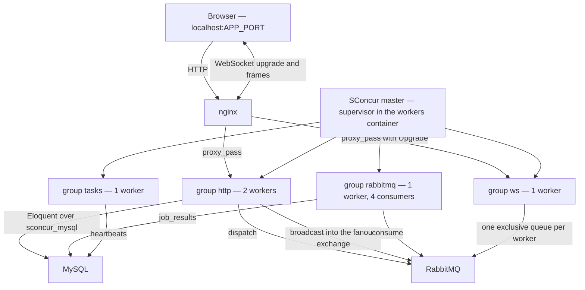

English | [Русский](README.ru.md)

# Demo application

A minimal Laravel application the SConcur master serves, so the package can be seen
working rather than only read about. `make setup` brings it up on
`http://localhost:${APP_PORT}` (48081 by default).

It is not the test workbench. `workbench/` runs under `orchestra/testbench` and belongs
to the test suite; this one carries its own `bootstrap/app.php` because it needs the
application to be a `SConcur\Laravel\Foundation\AsyncApplication`, and testbench builds
`Illuminate\Foundation\Application` itself.

Nothing is installed here: `demo/vendor` is a symlink to the repository's own `vendor`,
and the classes are autoloaded through the root `composer.json` (`Demo\App\` →
`demo/app/`). One install, one lock, no way for the package and the application
demonstrating it to drift apart. The `composer.json` in this directory is never
installed from — Laravel reads the one at its base path (`Application::getNamespace()`
does so without checking that it exists, so a missing file turns every error page into
a different error), and this is that file.

## What runs where



All four groups are pools of one master, configured in `demo/config/sconcur.php`.
The master's telemetry panel is what the page's top section reads.

## State after a restart

MySQL and RabbitMQ keep their data in tmpfs, so stopping either container leaves the
schema and the queue gone. The workers container migrates and declares from its
entrypoint before starting the master, so a restart repairs itself — both commands are
idempotent, and a failure there is reported without keeping the container down. To do it
by hand: `make demo-reset`.

## Endpoints

| Endpoint | What it shows |
|---|---|
| `GET /` | the page: telemetry, and a control for each of the sections below |
| `GET /api/health` | liveness; `make setup` and CI check this one |
| `GET /api/concurrent?n=10&ms=200` | N cooperative pauses as coroutines of one `WaitGroup`, then the same N one after another. The concurrent leg takes about `ms`, the sequential one `n × ms` — same process, same thread |
| `GET /api/notes` / `POST /api/notes` | Eloquent over the `sconcur_mysql` connection |
| `POST /api/notes/bulk` | N inserts as coroutines, each in a transaction of its own — which holds on this connection because the nesting level is per coroutine and the extension pins each transaction to a physical connection |
| `POST /api/jobs` | dispatches `DemoJob` to RabbitMQ over the `sconcur_rabbitmq` driver |
| `GET /api/jobs` | what the consumer pool did with them, plus the `failed_jobs` count |
| `GET /api/heartbeats` | the counter the periodic task pool bumps |
| `GET /api/scaling` / `POST /api/scaling` | how many processes each pool runs and how many consumers the queue gets in each; a change rolls only the groups it affects |
| `GET /api/ws` | what the page needs to open its socket: the app key and the path, never the secret |
| `POST /api/ws/broadcast` | broadcasts `count` copies of `DemoBroadcast` on the `demo` channel, each numbered; `others=1` adds `toOthers()` |
| `GET /api/telemetry` | the master's panel, folded into what the page draws |

The sequential leg of `/api/concurrent` is skipped when `n × ms` would exceed 3 s: it
would really take that long, and a number nobody measured does not belong beside one
somebody did.

## The WebSocket panel

The page holds an upgraded connection to one ws worker and the button posts to an http
worker — two different processes, and the message arriving back on the socket is the whole
demonstration: what carried it across is the fanout exchange. The pids in the log are of
the two ends, so they do not match.

The client is written against the wire protocol with the browser's own `WebSocket` rather
than through `laravel-echo`: the demo has no bundler, and the frames are the same ones Echo
sends. A real application uses Echo — [docs/websocket.md](../docs/websocket.md) shows the
config it needs.

The badge beside the heading says what is true now — the log below only says what
happened. It carries the socket id once the handshake is through, and since a socket id is
the worker's pid and a counter, it also names the ws worker this browser landed on.

**messages** is how many to publish in one press. Each arrives as `<number> <text>`, so a
burst reads as a burst and its order is visible rather than guessed.

The **to others** box adds `->toOthers()`, so the browser that pressed the button is the
one that does not see the messages. With two tabs open the difference is visible; with one,
nothing arrives, which is the point.

Only the public `demo` channel is used here. Private and presence channels are authorized
through `/broadcasting/auth` against an authenticated user, and the demo has no users.

## Checking the pool without a browser

The page is the usual way to look at the pool, but it says nothing an exit code can be
read from. `demo/bin/ws-check.php` walks the same path from the outside and reports every
step:

```bash
make ws-check          # a burst of five
make ws-check c=50     # the largest burst the panel can send
```

```
ws check against scl-nginx:80, channel demo, burst of 50

  ok  handshake                         socket_id=27.19
  ok  the socket id names a worker      ws worker pid=27
  ok  ping
  ok  subscribe
  ok  publish over http                 http worker pid=25
  ok  the whole burst arrives           50 of 50, no duplicates

all checks passed
```

What each line stands for:

| Step | What it proves |
|---|---|
| handshake | nginx passes the upgrade through and the ws pool answers `pusher:connection_established` |
| the socket id names a worker | the id is the worker's pid and a counter, so it says which ws worker took this connection |
| ping | the connection is alive in both directions, not merely open |
| subscribe | the channel was accepted — for a public channel, without going near `/broadcasting/auth` |
| publish over http | the http worker accepted the burst; its pid differs from the ws worker's, which is the gap the bus crosses |
| the whole burst arrives | every message came back, numbered from one, with nothing missing and nothing twice |

It runs from the workers container, where the extension with the ws client lives, and it
exits non-zero on the first failure. A refused upgrade is reported as a failed handshake
with the reason on the line rather than as a stack trace — a wrong `SCONCUR_WS_APP_KEY`,
for instance, gives `Invalid status code: 404`, because the path carries the key and a
path that does not match is refused before PHP sees it.

`make sconcur-status` and `make ext-status` answer the two questions that come before all
of this: whether the `ws` group is up at all, and whether the loaded extension matches the
package.

## Changing the pool sizes

The **Pool sizes** panel writes the numbers to `demo/storage/app/scaling.json`, which
`demo/config/sconcur.php` reads while it builds the master config, and asks for the
affected groups to be rolled. `ws` is one of them: at one worker the bus still carries
every broadcast, and above one two browsers land on different workers, which is when it
starts carrying them somewhere the publisher could not reach on its own. Zero takes the
group out of the config, like it does for `rabbitmq`. The roll itself is done by `ScalingTask` in the periodic
task pool, not by the request and not by a queued job:

- reload waits for the roll to finish. An HTTP worker calling it would still be inside
  that wait when its own turn to be replaced came — the server waiting for the handler
  to drain, the handler waiting for the master — and the standoff ends at
  `shutdownTimeoutMs` with the worker killed and the request cut;
- a queued job has the same problem one pool over: rolling the `rabbitmq` group would
  take the consumer down from under the very message doing the rolling.

The task pool's own group is never one of the rolled ones, so it is the one process that
can watch a roll from outside. It also has to re-read `config/sconcur.php` before it
rolls: a long-lived process holds the config it started with, and reload hands the
master whatever the caller has — without that it would roll the groups onto the old
numbers and report success.

Setting the consumer processes to `0` is meaningful and worth trying: below one the group
leaves the master config entirely, which is the documented way to turn the pool off.
`workerCount: 0` would not do it — to the master that means one worker per CPU.

## Things worth trying by hand

```bash
# One process holding several messages at once: the rows come back carrying one pid
# and overlapping durations.
curl -sS -X POST localhost:48081/api/jobs \
     -H 'Content-Type: application/json' \
     -d '{"payload":"hello","count":8,"work_ms":2000}'
curl -sS localhost:48081/api/jobs | jq

# The failed_jobs path — the listener ConsumerRunner installs in place of queue:work.
curl -sS -X POST localhost:48081/api/jobs \
     -H 'Content-Type: application/json' -d '{"payload":"fail"}'

# The task pool, controlled from another container through a cache key rather than a pid.
# `stop` without --task ends the pool's process; its group is restartPolicy=on-failure,
# so a clean exit is left down on purpose and `make sconcur-reload` is what brings it
# back.
make tasks-stop                                    # the heartbeat counter freezes
make sconcur-reload                                # it moves again, in a fresh process

# One task at a time: stop parks it and the pool keeps running, restart brings it back.
make demo-art c='sconcur:tasks:stop --task=heartbeat'
make demo-art c='sconcur:tasks:restart --task=heartbeat'

# Rolling reload: the workers still listening keep the port served.
make sconcur-reload
make sconcur-status

# The same pages on the ordinary PDO connection — DB_CONNECTION=mysql in .env, then:
make sconcur-reload
```

Switching `DB_CONNECTION` to `mysql` is the comparison the package exists for.
`/api/notes/bulk` is where it shows: on PDO the handle is one per process, so the
concurrent transactions are not each other's business any more.
