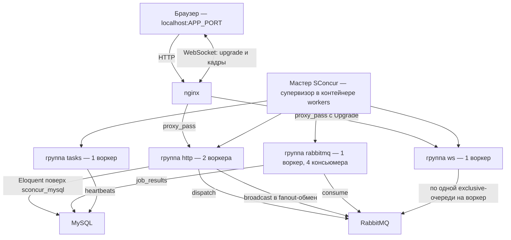

[English](README.md) | Русский

# Демо-приложение

Минимальное Laravel-приложение, которое отдаёт мастер SConcur, — чтобы пакет можно было
увидеть в работе, а не только прочитать про него. `make setup` поднимает его на
`http://localhost:${APP_PORT}` (по умолчанию 48081).

Это не тестовый стенд. `workbench/` работает под `orchestra/testbench` и принадлежит
тестам; у демо свой `bootstrap/app.php`, потому что приложение должно быть
`SConcur\Laravel\Foundation\AsyncApplication`, а testbench строит
`Illuminate\Foundation\Application` сам.

Здесь ничего не устанавливается: `demo/vendor` — симлинк на `vendor` репозитория, а классы
автозагружаются через корневой `composer.json` (`Demo\App\` → `demo/app/`). Одна установка,
один lock, и пакет с приложением, которое его демонстрирует, не могут разъехаться по
версиям. Из `composer.json` в этом каталоге никогда не ставят: Laravel читает файл по
своему base path (`Application::getNamespace()` делает это, не проверяя существование,
поэтому отсутствующий файл превращает любую страницу ошибки в другую ошибку), и это как
раз он.

## Что где работает



Все четыре группы — пулы одного мастера, описанные в `demo/config/sconcur.php`.
Верхняя секция страницы читает панель телеметрии этого мастера.

## Состояние после рестарта

MySQL и RabbitMQ держат данные в tmpfs, поэтому остановка любого из контейнеров уносит
схему и очередь. Контейнер workers перед стартом мастера мигрирует и объявляет очереди из
своего entrypoint, так что рестарт чинит себя сам — обе команды идемпотентны, а сбой в них
сообщается, не роняя контейнер. Руками — `make demo-reset`.

## Эндпоинты

| Эндпоинт | Что показывает |
|---|---|
| `GET /` | страница: телеметрия и по контролу на каждый раздел ниже |
| `GET /api/health` | liveness; его проверяют `make setup` и CI |
| `GET /api/concurrent?n=10&ms=200` | N кооперативных пауз корутинами одной `WaitGroup`, затем те же N подряд. Конкурентный проход занимает около `ms`, последовательный — `n × ms`, в одном процессе и одном потоке |
| `GET /api/notes` / `POST /api/notes` | Eloquent поверх соединения `sconcur_mysql` |
| `POST /api/notes/bulk` | N вставок корутинами, каждая в своей транзакции — на этом соединении так можно, потому что уровень вложенности хранится по корутинам, а расширение закрепляет транзакцию за физическим соединением |
| `POST /api/jobs` | отправляет `DemoJob` в RabbitMQ через драйвер `sconcur_rabbitmq` |
| `GET /api/jobs` | что с ними сделал пул консьюмеров, плюс счётчик `failed_jobs` |
| `GET /api/heartbeats` | счётчик, который наращивает пул периодических задач |
| `GET /api/scaling` / `POST /api/scaling` | сколько процессов держит каждый пул и сколько консьюмеров получает очередь в каждом; изменение прокатывает только затронутые группы |
| `GET /api/ws` | то, что нужно странице, чтобы открыть сокет: ключ приложения и путь, но не секрет |
| `POST /api/ws/broadcast` | вещает `count` копий `DemoBroadcast` в канал `demo`, каждую с номером; `others=1` добавляет `toOthers()` |
| `GET /api/telemetry` | панель мастера, свёрнутая до того, что рисует страница |

Последовательный проход `/api/concurrent` пропускается, когда `n × ms` превысило бы 3 с:
он бы действительно столько и занял, а число, которого никто не мерил, не должно стоять
рядом с измеренным.

## Панель WebSocket

Страница держит поднятое соединение с одним ws-воркером, а кнопка постит в http-воркер —
это два разных процесса, и пришедшее обратно по сокету сообщение и есть вся демонстрация:
через границу его перенёс fanout-обмен. Пиды в логе — от двух концов, поэтому они не
совпадают.

Клиент написан по проводному протоколу на браузерном `WebSocket`, а не через
`laravel-echo`: сборщика у демо нет, а кадры те же самые, что шлёт Echo. Настоящее
приложение использует Echo — нужный конфиг показан в
[docs/websocket.ru.md](../docs/websocket.ru.md).

Метка рядом с заголовком говорит, что происходит сейчас, — журнал ниже говорит только о
том, что уже случилось. После рукопожатия метка несёт socket id, а поскольку socket id —
это пид воркера и счётчик, она заодно называет ws-воркера, на которого попал этот браузер.

**messages** — сколько сообщений опубликовать за одно нажатие. Каждое приходит в формате
`<номер> <текст>`, поэтому пачка читается как пачка и её порядок видно, а не додумывается.

Флажок **to others** добавляет `->toOthers()`, поэтому браузер, который нажал кнопку, —
как раз тот, кто сообщений не увидит. На двух вкладках разница видна; на одной не приходит
ничего, в чём и смысл.

Используется только публичный канал `demo`. Приватные и presence-каналы авторизуются через
`/broadcasting/auth` под аутентифицированным пользователем, а пользователей у демо нет.

## Изменение размеров пулов

Панель **Pool sizes** пишет числа в `demo/storage/app/scaling.json`, который
`demo/config/sconcur.php` читает, пока строит конфиг мастера, и просит прокатить
затронутые группы. `ws` — одна из них: при одном воркере шина всё равно несёт каждое
вещание, а больше одного — два браузера попадают на разных воркеров, и вот тогда она несёт
их туда, куда публикующий сам не дотянулся бы. Ноль убирает группу из конфига, как и у
`rabbitmq`. Сам прокат делает `ScalingTask` в пуле периодических задач, а не запрос и не
джоба:

- reload ждёт окончания проката. HTTP-воркер, который его позвал, всё ещё был бы внутри
  этого ожидания, когда придёт его собственная очередь на замену: сервер ждёт, пока
  обработчик дренируется, обработчик ждёт мастера, — и стояние заканчивается на
  `shutdownTimeoutMs` убитым воркером и оборванным запросом;
- у джобы та же беда на пул левее: прокат группы `rabbitmq` увёл бы консьюмера из-под
  того самого сообщения, которое прокат и запустило.

Группа самого пула задач в число прокатываемых не входит, поэтому он — единственный
процесс, который может смотреть на прокат со стороны. Ему же приходится перечитывать
`config/sconcur.php` перед прокатом: долгоживущий процесс держит конфиг, с которым
стартовал, а reload отдаёт мастеру то, что есть у вызывающего, — без этого он прокатил бы
группы на старых числах и отчитался об успехе.

Выставить процессы консьюмеров в `0` осмысленно и стоит попробовать: меньше одного —
и группа уходит из конфига мастера, а это и есть документированный способ выключить пул.
`workerCount: 0` так не работает — для мастера это означает воркер на ядро.

## Что стоит попробовать руками

```bash
# Один процесс держит несколько сообщений разом: строки возвращаются с одним пидом
# и пересекающимися длительностями.
curl -sS -X POST localhost:48081/api/jobs \
     -H 'Content-Type: application/json' \
     -d '{"payload":"hello","count":8,"work_ms":2000}'
curl -sS localhost:48081/api/jobs | jq

# Путь failed_jobs — слушатель, которого ConsumerRunner ставит вместо queue:work.
curl -sS -X POST localhost:48081/api/jobs \
     -H 'Content-Type: application/json' -d '{"payload":"fail"}'

# Пул задач, управляемый из другого контейнера через ключ кэша, а не через пид.
# `stop` без --task завершает процесс пула; его группа — restartPolicy=on-failure,
# поэтому чистый выход намеренно оставляют лежать, а поднимает обратно
# `make sconcur-reload`.
make tasks-stop                                    # счётчик heartbeat замирает
make sconcur-reload                                # снова растёт, уже в новом процессе

# По одной задаче: stop снимает её с тика, пул продолжает работать, restart возвращает.
make demo-art c='sconcur:tasks:stop --task=heartbeat'
make demo-art c='sconcur:tasks:restart --task=heartbeat'

# Rolling reload: воркеры, которые ещё слушают, держат порт обслуженным.
make sconcur-reload
make sconcur-status

# Те же страницы на обычном PDO-соединении — DB_CONNECTION=mysql в .env, затем:
make sconcur-reload
```

Переключение `DB_CONNECTION` на `mysql` — то самое сравнение, ради которого пакет и есть.
Видно оно на `/api/notes/bulk`: на PDO хэндл один на процесс, поэтому конкурентные
транзакции перестают быть друг другу чужими.
