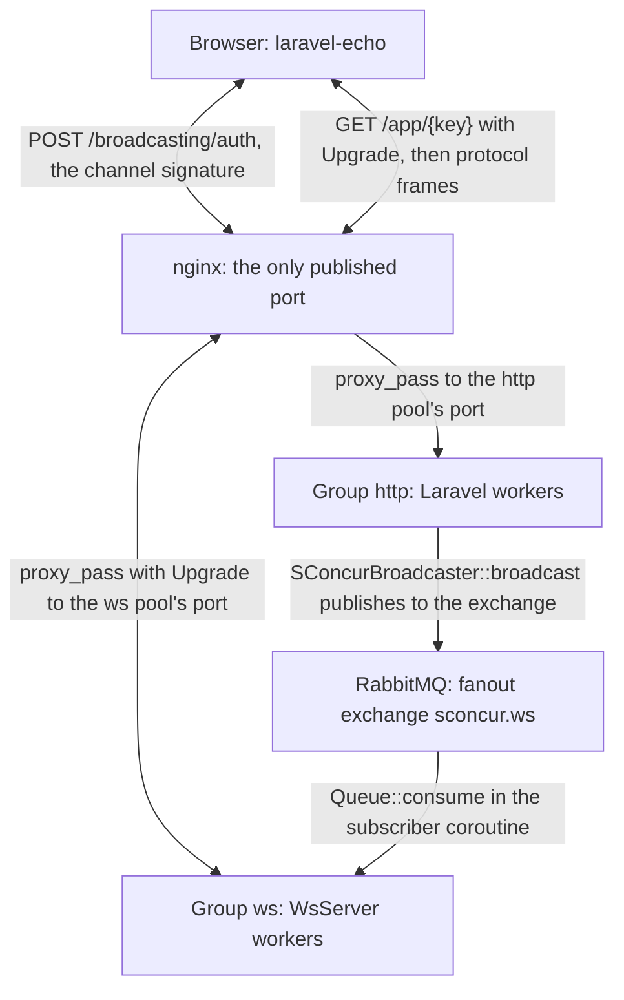
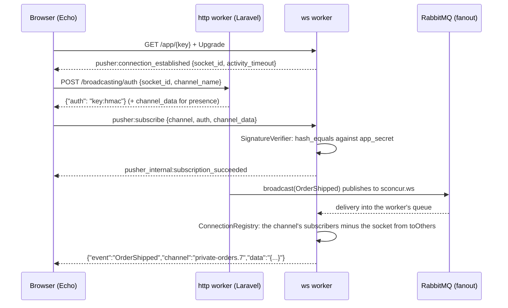

English | [Русский](websocket.ru.md)

# The WebSocket pool

The package's fourth runtime, beside the HTTP server, the RabbitMQ consumer pool and the
periodic task pool: the same master group, the same `config/sconcur.php`, the same
telemetry. From the application's side it is ordinary Laravel broadcasting
(`broadcast(new OrderShipped($order))`); from the browser's side it is ordinary
`laravel-echo`.

## Table of contents

- [What lives where](#what-lives-where)
- [Topology](#topology)
- [Examples](#examples)
- [The protocol](#the-protocol)
- [Channels and signatures](#channels-and-signatures)
- [The life of a client](#the-life-of-a-client)
- [The bus](#the-bus)
- [The life of the subscriber coroutine](#the-life-of-the-subscriber-coroutine)
- [Presence channels](#presence-channels)
- [Configuration](#configuration)
- [What it does not do](#what-it-does-not-do)

## What lives where

`SConcur\Features\WsServer\WsServer` from the library keeps the listener and the handshake
in the extension and hands every upgraded connection to PHP, each in a coroutine of its
own. Everything else is here:

| Concern | Where |
|---|---|
| Protocol frames | `src/Ws/Protocol/` |
| Channel signature check | `src/Ws/Auth/SignatureVerifier.php` |
| The process's connections and subscriptions | `src/Ws/ConnectionRegistry.php` |
| One client's loop | `src/Ws/ConnectionHandler.php` |
| Delivery between processes | `src/Ws/Bus/` |
| The presence member list | `src/Ws/Presence/` |
| The Laravel broadcast driver | `src/Ws/Broadcasting/SConcurBroadcaster.php` |
| Starting a worker | `src/Ws/WsServerRunner.php`, `src/Console/WsStartCommand.php` |

## Topology



The consumer pool and the task pool publish to the same bus through the same driver.

## Examples

The examples are written against `laravel-echo` 2.4.0 and `pusher-js` 8.6.0.

### Turning it on

```php
// config/broadcasting.php
'connections' => [
    'sconcur' => ['driver' => 'sconcur'],
],
```

```dotenv
BROADCAST_CONNECTION=sconcur

SCONCUR_WS_WORKER_COUNT=2
SCONCUR_WS_APP_KEY=some-public-key
SCONCUR_WS_APP_SECRET=some-private-secret
```

The key and the secret are not repeated anywhere else: the broadcast driver, the
connection handler and the group's path all read them from `config('sconcur.ws')`.

The proxy in front needs a `location` of its own for the upgrade. An upgraded connection is
long-lived, so the ordinary block's timeouts would cut every client loose once a minute:

```nginx
# `map` belongs to the http level, outside the server block: "upgrade" while the client
# asks for one and "close" otherwise, so an ordinary request is not told to switch.
map $http_upgrade $connection_upgrade {
    default upgrade;
    ''      close;
}

location /app/ {
    proxy_pass http://127.0.0.1:28090;

    proxy_http_version 1.1;

    proxy_set_header Upgrade    $http_upgrade;
    proxy_set_header Connection $connection_upgrade;

    proxy_set_header Host              $host;
    proxy_set_header X-Real-IP         $remote_addr;
    proxy_set_header X-Forwarded-For   $proxy_add_x_forwarded_for;
    proxy_set_header X-Forwarded-Proto $scheme;

    proxy_read_timeout 3600s;
    proxy_send_timeout 3600s;
}
```

The location has to match `SCONCUR_WS_PATH_PREFIX`; the key follows it in the path.

```js
// resources/js/echo.js — nothing of its own, an ordinary pusher client
window.Echo = new Echo({
    broadcaster: 'pusher',
    key: import.meta.env.VITE_SCONCUR_WS_KEY,
    wsHost: window.location.hostname,
    wsPort: 80,
    forceTLS: false,
    disableStats: true,
    enabledTransports: ['ws', 'wss'],
    cluster: '',
});
```

### A public channel

```php
namespace App\Events;

use Illuminate\Broadcasting\Channel;
use Illuminate\Contracts\Broadcasting\ShouldBroadcast;
use Illuminate\Foundation\Events\Dispatchable;

class OrderShipped implements ShouldBroadcast
{
    use Dispatchable;

    public function __construct(public readonly int $orderId)
    {
    }

    /**
     * @return list<Channel>
     */
    public function broadcastOn(): array
    {
        return [new Channel('orders')];
    }

    public function broadcastAs(): string
    {
        return 'order.shipped';
    }

    /**
     * @return array<string, mixed>
     */
    public function broadcastWith(): array
    {
        return ['id' => $this->orderId];
    }
}
```

```php
OrderShipped::dispatch($order->id);
```

```js
Echo.channel('orders').listen('.order.shipped', (payload) => console.log(payload.id));
```

The leading dot is required whenever the event declares `broadcastAs()`: without it Echo
prefixes its own `App.Events` namespace. That is Echo's rule, not the pool's.

`ShouldBroadcast` goes through the queue, `ShouldBroadcastNow` publishes straight from the
same process. To the pool there is no difference: the same driver publishes either way.

### A private channel

```php
// routes/channels.php
Broadcast::channel('orders.{orderId}', function (User $user, int $orderId): bool {
    return Order::whereKey($orderId)->whereBelongsTo($user)->exists();
});
```

```php
public function broadcastOn(): array
{
    return [new PrivateChannel('orders.' . $this->orderId)];
}
```

```js
Echo.private(`orders.${orderId}`).listen('.order.shipped', (payload) => { /* … */ });
```

Echo calls the application's own `/broadcasting/auth`, the callbacks in
`routes/channels.php` run there, and a signature comes back. The ws worker only verifies
it — it has neither a database nor a session on its side.

### A presence channel

```php
// routes/channels.php — return the member's data rather than a bool
Broadcast::channel('room.{roomId}', function (User $user, int $roomId): ?array {
    return $user->canJoin($roomId)
        ? ['id' => $user->id, 'name' => $user->name]
        : null;
});
```

```php
public function broadcastOn(): array
{
    return [new PresenceChannel('room.' . $this->roomId)];
}
```

```js
Echo.join(`room.${roomId}`)
    .here((members) => console.log('already here:', members))
    .joining((member) => console.log('joined:', member.name))
    .leaving((member) => console.log('left:', member.name))
    .listen('.message.posted', (payload) => { /* … */ });
```

`here()` arrives inside the subscription reply and therefore carries the whole list at
once; with several workers it is assembled from the shared store, see
[Presence channels](#presence-channels).

One person with two tabs is one member: `joining()` does not fire for the second tab, and
`leaving()` fires only when the last one closes.

### Not sending to the originator

```php
use Illuminate\Broadcasting\InteractsWithSockets;

class OrderShipped implements ShouldBroadcast
{
    use Dispatchable;
    use InteractsWithSockets;
```

```php
broadcast(new OrderShipped($order->id))->toOthers();
```

Without the `InteractsWithSockets` trait, `toOthers()` does nothing and says nothing: there
is nowhere to write the socket id, so it never reaches the message.

Echo sets the `X-Socket-ID` header itself, but only for the clients it hooks into: axios,
jQuery, Vue Resource, Turbo. A request sent through `fetch` needs the header by hand:

```js
fetch('/api/orders/42/ship', {
    method: 'POST',
    headers: {'X-Socket-ID': Echo.socketId()},
});
```

### Client events

One subscriber talking to the others without going through the application. Off by
default, as with Pusher:

```dotenv
SCONCUR_WS_CLIENT_EVENTS=true
SCONCUR_WS_CLIENT_EVENTS_PER_MINUTE=60
```

```js
Echo.private(`orders.${orderId}`)
    .listenForWhisper('typing', (payload) => console.log(payload.name, 'is typing'))
    .whisper('typing', {name: 'Ann'});
```

It works on `private-` and `presence-` channels only, and only for subscribers of that
channel. The author does not get their own event back. The rate limit is counted per
connection: once it is spent, the client is silently unheard until the next minute.

### Broadcasting from outside HTTP

The driver is the same wherever it is called from — what matters is that it publishes to
the bus rather than into process memory:

```php
class NotifyShipment implements ShouldQueue
{
    public function handle(): void
    {
        broadcast(new OrderShipped($this->orderId));
    }
}
```

```php
class ReportTask implements TaskInterface
{
    public function tick(): TickResultEnum
    {
        broadcast(new StatsUpdated($this->collect()));

        return TickResultEnum::Worked;
    }
}
```

### The pool's own events

The pool raises ordinary Laravel events, which are convenient for counting connections or
keeping a log:

```php
use SConcur\Laravel\Ws\Events\ChannelSubscribed;
use SConcur\Laravel\Ws\Events\ClientEventReceived;
use SConcur\Laravel\Ws\Events\ConnectionClosed;
use SConcur\Laravel\Ws\Events\ConnectionOpened;

Event::listen(ConnectionOpened::class, function (ConnectionOpened $event): void {
    Log::info('ws opened', ['socket' => $event->socketId, 'from' => $event->remoteAddr]);
});
```

The listener runs in the ws worker, in that connection's coroutine. Anything it does
blockingly stops the whole worker — writing to a database from there with a synchronous
driver is a bad idea.

### A front end on its own origin

Nothing changes on the server's side: any SPA will do as long as it speaks this protocol.
`laravel-echo` and `pusher-js` ship types (`dist/echo.d.ts`), so in TypeScript it looks
like this:

```ts
// composables/useEcho.ts
import Echo from 'laravel-echo'
import Pusher from 'pusher-js'

export const echo = new Echo<'pusher'>({
    broadcaster: 'pusher',
    Pusher,
    key: import.meta.env.VITE_SCONCUR_WS_KEY,
    // The API host, not the front end's: the socket goes where the other requests go.
    wsHost: import.meta.env.VITE_API_HOST,
    wsPort: 80,
    forceTLS: false,
    disableStats: true,
    enabledTransports: ['ws', 'wss'],
    cluster: '',
    authEndpoint: `${import.meta.env.VITE_API_URL}/broadcasting/auth`,
    bearerToken: localStorage.getItem('token'),
})
```

Three things people trip over:

1. **The socket connection itself has nothing to do with CORS** — a handshake has no
   preflight, and the browser asks no permission. The pool does not pass an
   `allowedOrigins` check to the server either: it is an array, and `WsServer::fromArgs`
   parses scalars only. So anyone can open a connection from anywhere, and what protects
   the data is the channel signature rather than the origin. A barrier on the connection
   itself is a firewall or nginx, not the pool.
2. **`/broadcasting/auth`, on the other hand, is an ordinary cross-origin POST**, and it
   needs both CORS and a way to identify the user. Either a Sanctum session with
   `withCredentials`, or a token: Echo has `bearerToken` and `auth.headers` for that and
   sets the `Authorization` header itself. Public channels do not touch this route at all.
3. **`wsHost` points at the API host.** The nginx in front of it has to pass the upgrade
   through on `/app/` — the same separate `location` a monolith needs.

### A client without Echo

Echo is not required: the protocol is described in full below, and this repository's demo
page speaks it over a plain `WebSocket`, with no build step and no dependencies. The frame
order is the same:

```ts
const socket = new WebSocket(`wss://${host}/app/${key}?protocol=7`)

socket.onmessage = (message) => {
    const frame = JSON.parse(message.data)
    // `data` is a string with JSON inside, both ways. That is the protocol, not an accident.
    const data = typeof frame.data === 'string' ? JSON.parse(frame.data || '{}') : frame.data

    if (frame.event === 'pusher:connection_established') {
        socket.send(JSON.stringify({event: 'pusher:subscribe', data: {channel: 'orders'}}))
    }

    if (frame.event === 'pusher:ping') {
        socket.send(JSON.stringify({event: 'pusher:pong', data: {}}))
    }
}
```

A private channel adds the `auth` obtained from `/broadcasting/auth` to `pusher:subscribe`;
a presence channel adds `channel_data` from the same reply.

### Publishing from outside Laravel

The bus is an ordinary fanout exchange, so any service that speaks AMQP can put a message
into it. The body is flat JSON:

```json
{
  "channels": ["private-orders.7"],
  "event": "OrderShipped",
  "data": "{\"id\":7}",
  "socket": null
}
```

`data` is a string with JSON inside, exactly the one that reaches the client: the workers
do not parse it. `socket` is the connection not to deliver to (the equivalent of
`toOthers()`); the key may be absent altogether. A message that does not parse is skipped
silently — the bus is shared, and somebody else's frame must not bring a worker down.

Exactly one thing stays with Laravel: issuing the signature for private and presence
channels, because it is computed from the application's own access rules.

### When nothing arrives

Top to bottom:

1. Does `sconcur:servers:master:status` show the `ws` group? Below one worker there is no
   group in the config at all.
2. `sconcur:extension:status` — does the extension's version match the package's?
3. Did the client connect at all? A wrong key in the path gives `404` on the handshake and
   never reaches PHP: compare `SCONCUR_WS_APP_KEY` with Echo's `key`.
4. Does nginx pass the upgrade through on that path? It needs a separate `location` with
   `proxy_set_header Upgrade` and a large `proxy_read_timeout` — a block with ordinary
   timeouts cuts the connection once a minute.
5. Did the subscription succeed? A refusal arrives as `pusher:subscription_error`, and Echo
   hands it to `.error()`. Most often the signature did not match — the secret has to be
   the same in the http worker and in the ws worker. With a front end on its own origin,
   look at `/broadcasting/auth` too: the socket opens without CORS but that request does
   not, and its rejected preflight looks like a silent private channel.
6. Did the event reach the bus? The `sconcur.ws` exchange is visible in the RabbitMQ panel,
   with one bound queue per ws worker that has at least one connection. An idle worker has
   no queue: the subscriber leaves with the last client.
7. The first event right after the first connection may not arrive. The bus subscriber
   comes up together with the first connection, and until it has bound its queue the fanout
   drops the message — the exchange has no recipients yet. The window is tens of
   milliseconds and concerns only a worker that was idle before.
8. Everyone got it except the sender? That is what `toOthers()` is for.

### Checking the pool from a command

The list above is a checklist to walk by hand. An application that runs the pool in more
than one environment is better off with a command that walks it: the same path — handshake,
ping, subscribe, publish, delivery — with an exit code at the end, so a deploy or a health
check can read the answer.

The library ships a ws client of its own, `SConcur\Features\WsClient\WsClient`, and it is
what makes this possible without a browser or a JavaScript runtime. Two files: an event to
send, and the command.

```php
namespace App\Events;

use Illuminate\Broadcasting\Channel;
use Illuminate\Contracts\Broadcasting\ShouldBroadcastNow;
use Illuminate\Foundation\Events\Dispatchable;

class PingCheck implements ShouldBroadcastNow
{
    use Dispatchable;

    public function __construct(
        private readonly string $channel,
        public readonly int $number,
    ) {
    }

    /** @return list<Channel> */
    public function broadcastOn(): array
    {
        return [new Channel($this->channel)];
    }

    public function broadcastAs(): string
    {
        return 'ping.check';
    }

    /** @return array<string, mixed> */
    public function broadcastWith(): array
    {
        return ['number' => $this->number];
    }
}
```

`ShouldBroadcastNow` rather than `ShouldBroadcast`: the check should not depend on a queue
consumer running, and a check that waits for one measures the queue instead of the pool.

```php
namespace App\Console\Commands;

use App\Events\PingCheck;
use Illuminate\Console\Command;
use SConcur\Features\WsClient\WsClient;
use SConcur\Features\WsClient\WsClientOptions;
use Throwable;

class WsCheck extends Command
{
    protected $signature = 'ws:check {--host=127.0.0.1:8080} {--channel=diagnostics} {--count=5}';

    protected $description = 'Walks the WebSocket pool end to end and answers with an exit code';

    public function handle(): int
    {
        $key     = (string) config('sconcur.ws.app_key');
        $prefix  = (string) config('sconcur.ws.path_prefix', '/app');
        $host    = (string) $this->option('host');
        $channel = (string) $this->option('channel');
        $count   = max(1, (int) $this->option('count'));

        // readTimeoutMs is what turns a silent pool into a failed check rather than a
        // command that hangs: every read below is bounded by it.
        $client = new WsClient(new WsClientOptions(readTimeoutMs: 8_000));

        try {
            $connection = $client->connect("ws://$host$prefix/$key?protocol=7");
        } catch (Throwable $exception) {
            // The upgrade is refused before PHP sees anything when the pool is down or the
            // key in the path is not the configured one — a 404 on the handshake.
            $this->error('handshake: ' . $exception->getMessage());

            return self::FAILURE;
        }

        $established = json_decode((string) $connection->read(), true);

        $socketId = (string) (json_decode((string) ($established['data'] ?? '{}'), true)['socket_id'] ?? '');

        // The socket id is the ws worker's pid and a counter, so it also names the worker
        // this connection landed on.
        $this->line("handshake: socket_id=$socketId, ws worker pid=" . strtok($socketId, '.'));

        $connection->write((string) json_encode(['event' => 'pusher:ping', 'data' => []]));

        $pong = (string) (json_decode((string) $connection->read(), true)['event'] ?? '');

        $connection->write((string) json_encode([
            'event' => 'pusher:subscribe',
            'data'  => ['channel' => $channel],
        ]));

        $subscribed = (string) (json_decode((string) $connection->read(), true)['event'] ?? '');

        // Published from this process, which is not the ws worker holding the socket, so a
        // message that comes back has crossed the bus.
        for ($number = 1; $number <= $count; $number++) {
            PingCheck::dispatch($channel, $number);
        }

        $numbers = [];

        for ($read = 0; $read < $count; $read++) {
            $frame = json_decode((string) $connection->read(), true);

            if (($frame['event'] ?? '') !== 'ping.check') {
                continue;
            }

            $numbers[] = (int) (json_decode((string) $frame['data'], true)['number'] ?? 0);
        }

        $connection->close();

        sort($numbers);

        $this->line('ping: ' . $pong);
        $this->line('subscribe: ' . $subscribed);
        $this->line('delivery: ' . count($numbers) . " of $count");

        return $pong === 'pusher:pong'
            && $subscribed === 'pusher_internal:subscription_succeeded'
            && $numbers === range(1, $count)
                ? self::SUCCESS
                : self::FAILURE;
    }
}
```

```
$ php artisan ws:check --host=example.test --channel=diagnostics --count=50
handshake: socket_id=27.22, ws worker pid=27
ping: pusher:pong
subscribe: pusher_internal:subscription_succeeded
delivery: 50 of 50
```

```
$ php artisan ws:check --host=example.test
handshake: Failed to connect to ws://example.test/app/nope?protocol=7: net: wsClient:
connect ws://example.test/app/nope?protocol=7: Invalid status code: 404
```

What each line answers:

| Line | What it proves |
|---|---|
| handshake | the upgrade passes through the proxy and the pool answers `pusher:connection_established`; the pid says which worker took the connection |
| ping | the connection is alive in both directions, not merely open |
| subscribe | the channel was accepted. On a public channel that happens without `/broadcasting/auth`; a `private-` one needs a signature, which is a separate check |
| delivery | every message came back, numbered from one, with nothing missing and nothing twice — so the bus carries the event from a publishing process to the worker holding the socket |

What it leaves out. `--host` through the proxy covers the proxy's upgrade block as well,
and against the pool's own port it does not — a check that passes there while browsers fail
is the proxy's doing. The channel is public, so authorization is untouched; to cover a
signature, ask `/broadcasting/auth` for one and put it into `pusher:subscribe`. And the
connection lands on whichever worker the kernel gives it, so a pool larger than one worker
is covered by running the check as many times as there are workers and collecting the
pids.

This repository's demo carries the same walk as a standalone script rather than a command,
because the demo publishes over HTTP to show the process boundary: `make ws-check` and
[demo/README.md](../demo/README.md#checking-the-pool-without-a-browser).

## The protocol

A compatible subset of Pusher v7. That is what lets `laravel-echo` work with no client of
its own, and channel authorization go through the application's ordinary
`/broadcasting/auth` route.

One rule holds the rest together: the `data` field travels as a string with JSON inside
rather than as a nested object. Both sides do it, and a frame with a nested object is
dropped silently by the client.

### Server → client

| Event | When |
|---|---|
| `pusher:connection_established` | right after the upgrade; `data` carries `socket_id` and `activity_timeout` |
| `pusher_internal:subscription_succeeded` | the subscription is accepted; for presence, with a `presence` block |
| `pusher:pong` | the reply to `pusher:ping` |
| `pusher:error` | the connection is refused; a close follows |
| `pusher:subscription_error` | a refusal for one channel; the connection stays |
| `pusher_internal:member_added` / `member_removed` | a presence channel |
| an application event | delivery from the bus |

### Client → server

| Event | `data` |
|---|---|
| `pusher:subscribe` | `channel`, `auth`, `channel_data` |
| `pusher:unsubscribe` | `channel` |
| `pusher:ping` | `{}` |
| `client-*` | an arbitrary payload; private/presence only, and only when the option is on |

Anything that does not parse or is not on the list is ignored: a client newer than the
server should not lose its connection over it.

### Error codes

The range matters more than the number — it decides whether the client reconnects:
`4000–4099` — do not reconnect, `4100–4199` — reconnect after a pause, `4200–4299` —
reconnect at once.

| Code | When |
|---|---|
| `4001` | the application key in the path is not the right one |
| `4009` | the signature did not match, a private channel without `auth`, an encrypted channel |
| `4100` | the per-connection channel limit is exceeded |

## Channels and signatures

| Prefix | Type | What it requires |
|---|---|---|
| none | public | nothing |
| `private-` | private | a signature |
| `presence-` | presence | a signature and `channel_data` |
| `private-encrypted-` | encrypted | not supported, answered with `pusher:subscription_error` |

The ws worker goes to neither the database nor the session: the right to a channel is
proven by the signature the http worker issued.

```
signature = hash_hmac('sha256', "{socket_id}:{channel}", app_secret)
auth      = "{app_key}:{signature}"
```

For presence the `channel_data` string is added as a third segment of the signed string —
without it a client could rewrite who it claims to be on the way to the ws worker. The
comparison is `hash_equals`.

Both sides of that signature live in the package:
`SConcurBroadcaster::validAuthenticationResponse` issues it, `SignatureVerifier::verify`
checks it. `BroadcasterTest` closes the loop between them, and that loop is what any change
to the format breaks.

## The life of a client



## The bus

An event is raised in an http worker, in a queue consumer or in a task, while the
connections live in ws workers. `Connection::write` does not cross that boundary — the
extension routes a write by `id` inside its own process.

An HTTP API inside the ws server itself, the way Reverb has one, is impossible here: the ws
server serves no application routes (anything that is not an upgrade gets `426`), and under
`SO_REUSEPORT` an individual worker has no address of its own — the kernel hands out the
connections. So delivery goes through a RabbitMQ fanout exchange, and the library's
`Queue::consume()` is a generator that suspends the coroutine, which means it fits into the
server's loop without a single blocking call.

Every ws worker has a queue of its own: the broker names it, and the flags are
`exclusive: true`, `autoDelete: false`, `durable: false`.

**`autoDelete` has to be off.** The subscriber leaves the `consume()` generator on every
idle wake to check the registry, and leaving cancels the consumer. With `autoDelete` the
broker removes the queue as one left without consumers, and the next `consume()` gets a
`404 NOT_FOUND`, which takes the channel down with it. `exclusive` gives the same lifetime
but ties it to the connection: a dead worker takes its queue with it.

Deliveries are acknowledged automatically (`autoAck`). A broadcast is a notification, not a
job: a worker that was away for a second should miss the event rather than be handed a
minute of them at once. An application that needs guarantees needs a queue rather than a
broadcast.

The `local` driver (`SCONCUR_WS_BUS_DRIVER=local`) delivers nothing between processes and
is good for tests only.

## The life of the subscriber coroutine

The one non-obvious part of the implementation.

On a stop, `Scheduler::serve` stops accepting connections and waits for every spawned
coroutine to finish. An eternal subscriber coroutine never releases that counter, and the
graceful stop turns into a wait up to `shutdownTimeoutMs` ending in `SIGKILL`. The idle
diagnostics name the coroutine the scheduler is waiting for outright.

So the subscriber lives exactly as long as there is somebody to deliver to:

- the first connection spawns it through `Scheduler::get()->spawn()`;
- between deliveries it looks at the registry and leaves once it finds it empty;
- on a stop the extension closes the connections, `read()` returns `null`, the handlers
  return, the registry empties — and the subscriber leaves by itself.

For "between deliveries" to happen on a silent bus too, the subscriber's connection to the
broker is opened with a `readTimeoutSeconds` of its own: an expired wait raises a
`QueueException` ("Consumer timeout exceed"), which for the generator is idleness rather
than an ending. Catch it, check the registry, reopen the consumer.

Hence the price: a graceful stop is delayed by at most `readTimeoutSeconds` plus the two
second pause the extension gives push-only connections. So
`SCONCUR_WS_BUS_READ_TIMEOUT_SECONDS` has to stay noticeably below the group's
`shutdownTimeoutMs`.

A channel error is cured by reopening the channel rather than only the consumer: the
channel dies with the error, and so does the queue on it.

## Presence channels

The member list is the only state of the ws pool that does not fit into one process: the
kernel spreads the connections across the workers, and a list assembled by one of them is
not incomplete but wrong.

The split: the snapshot comes from a shared store, the changes travel over the bus.

- `PresenceRepositoryInterface` — `join`/`leave`/`members`.
- `MemoryPresenceRepository` — correct with exactly one worker.
- `CachePresenceRepository` — a `socketId => member` map under one key per channel, written
  under `Cache::lock`, with the TTL extended on every change (which is also the cleanup
  after a worker killed with `SIGKILL`).
- `store: auto` picks by pool size: `memory` with one worker, `cache` with several. An
  explicit `memory` with a pool larger than one worker is a warning from the start command
  rather than silent agreement.

The store counts members by connection, the protocol counts them by user: one person with
two tabs is one member. `PresencePayload` folds them together and decides whether a join
and a leave are worth announcing.

## Configuration

The `ws` group in `config('sconcur.master.groups')` and the `config('sconcur.ws')` section,
both listed in [configuration.md](configuration.md#the-ws-group).

Two values cannot be set the way the `http` group has them. `handlerTimeoutMs` is hard-coded
to zero because here it is a deadline on the whole life of a connection rather than on a
frame, and anything above zero cuts every client loose on a timer. `idleTimeoutMs` defaults
to zero because a silent client is normal — liveness is kept by `pingIntervalMs`.

## What it does not do

- No TLS and no `permessage-deflate` compression: nginx terminates the first, and the
  extension does not do the second.
- No Pusher HTTP API (`/apps/{id}/events`), webhooks or statistics: the bus took their
  place.
- No encrypted channels; a subscription to one is refused explicitly.
- No event history: a client that reconnects does not receive what it missed.
- An event sent in the first tens of milliseconds after the first connection to an idle
  worker may not reach it: the bus subscriber comes up together with that connection, and
  the fanout drops the message until its queue is bound.
- `sconcur:servers:master:reload` drops ws connections. For the http pool a reload is
  invisible; here it is not, and Echo reconnects on its own.
