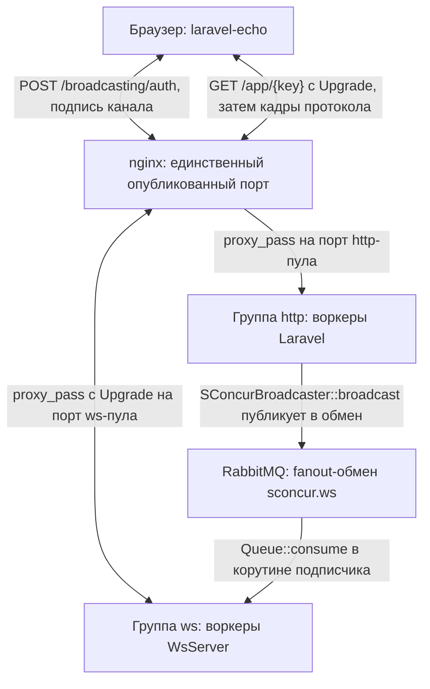
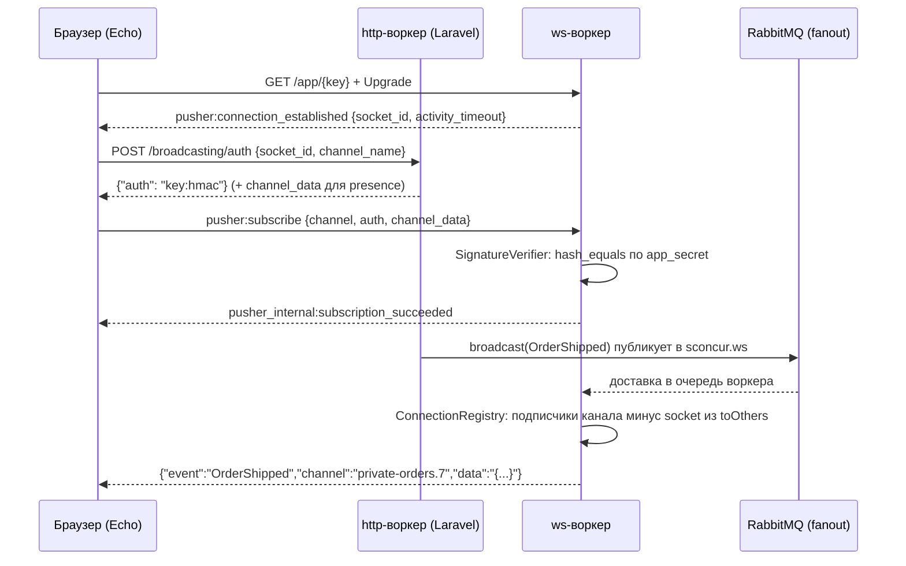

# WebSocket-пул

Четвёртая среда выполнения пакета, рядом с HTTP-сервером, пулом консьюмеров RabbitMQ и
пулом периодических задач: та же группа мастера, тот же `config/sconcur.php`, та же
телеметрия. Со стороны приложения это обычное вещание Laravel
(`broadcast(new OrderShipped($order))`), со стороны браузера — обычный `laravel-echo`.

## Что где живёт

`SConcur\Features\WsServer\WsServer` из библиотеки держит слушатель и рукопожатие в
расширении и отдаёт каждое поднятое соединение в PHP, в своей корутине. Всё остальное —
здесь:

| Задача | Где |
|---|---|
| Кадры протокола | `src/Ws/Protocol/` |
| Проверка подписи канала | `src/Ws/Auth/SignatureVerifier.php` |
| Соединения и подписки процесса | `src/Ws/ConnectionRegistry.php` |
| Цикл одного клиента | `src/Ws/ConnectionHandler.php` |
| Доставка между процессами | `src/Ws/Bus/` |
| Список участников presence-канала | `src/Ws/Presence/` |
| Драйвер вещания Laravel | `src/Ws/Broadcasting/SConcurBroadcaster.php` |
| Запуск воркера | `src/Ws/WsServerRunner.php`, `src/Console/WsStartCommand.php` |

## Топология



Пул консьюмеров и пул задач публикуют в ту же шину тем же драйвером — на схеме опущены,
чтобы не дублировать одну стрелку трижды.

## Протокол

Совместимое подмножество Pusher v7. Благодаря этому `laravel-echo` работает без своего
клиента, а авторизация канала идёт через штатный маршрут приложения
`/broadcasting/auth`.

Одно правило, на котором держится всё остальное: поле `data` едет строкой с JSON внутри,
а не вложенным объектом. Так делают обе стороны, и кадр с вложенным объектом клиент
молча выбрасывает.

### Сервер → клиент

| Событие | Когда |
|---|---|
| `pusher:connection_established` | сразу после Upgrade; `data` несёт `socket_id` и `activity_timeout` |
| `pusher_internal:subscription_succeeded` | подписка принята; для presence — блок `presence` |
| `pusher:pong` | ответ на `pusher:ping` |
| `pusher:error` | соединение отвергнуто; за ним следует закрытие |
| `pusher:subscription_error` | отказ по одному каналу; соединение остаётся |
| `pusher_internal:member_added` / `member_removed` | presence-канал |
| прикладное событие | доставка из шины |

### Клиент → сервер

| Событие | `data` |
|---|---|
| `pusher:subscribe` | `channel`, `auth`, `channel_data` |
| `pusher:unsubscribe` | `channel` |
| `pusher:ping` | `{}` |
| `client-*` | произвольная нагрузка, только private/presence и только при включённой опции |

Всё, что не разобралось или не входит в список, игнорируется: клиент новее сервера не
должен терять из-за этого соединение.

### Коды ошибок

Диапазон важнее номера — от него зависит, будет ли клиент переподключаться:
`4000–4099` — не переподключаться, `4100–4199` — с паузой, `4200–4299` — сразу.

| Код | Когда |
|---|---|
| `4001` | ключ приложения в пути не тот |
| `4009` | подпись не сошлась, приватный канал без `auth`, шифрованный канал |
| `4100` | превышен лимит каналов на соединение |

## Каналы и подписи

| Префикс | Тип | Что требуется |
|---|---|---|
| нет | публичный | ничего |
| `private-` | приватный | подпись |
| `presence-` | presence | подпись и `channel_data` |
| `private-encrypted-` | шифрованный | не поддерживается, отвечаем `pusher:subscription_error` |

Ws-воркер не ходит ни в базу, ни в сессию: право на канал подтверждает подпись, которую
выдал http-воркер.

```
signature = hash_hmac('sha256', "{socket_id}:{channel}", app_secret)
auth      = "{app_key}:{signature}"
```

Для presence в подписываемую строку добавляется третьим сегментом строка `channel_data` —
без этого клиент мог бы переписать, кем он представляется, по дороге к ws-воркеру.
Проверка — `hash_equals`.

Обе стороны этой подписи живут в пакете: `SConcurBroadcaster::validAuthenticationResponse`
выдаёт, `SignatureVerifier::verify` проверяет. Тест `BroadcasterTest` замыкает петлю
между ними — именно её ломает любая правка формата.

## Жизненный цикл клиента



## Шина

Событие поднимается в http-воркере, в консьюмере очереди или в задаче, а соединения живут
в ws-воркерах. `Connection::write` эту границу не пересекает — расширение маршрутизирует
запись по `id` внутри своего процесса.

HTTP-API в самом ws-сервере, как у Reverb, здесь невозможен: ws-сервер не обслуживает
прикладных маршрутов (всё, что не Upgrade, получает `426`), а под `SO_REUSEPORT` у
отдельного воркера нет своего адреса — соединения раздаёт ядро. Поэтому доставка идёт
через fanout-обмен RabbitMQ, а `Queue::consume()` из библиотеки — генератор,
приостанавливающий корутину, то есть встраивается в цикл сервера без единого
блокирующего вызова.

У каждого ws-воркера своя очередь: имя выдаёт брокер, флаги `exclusive: true`,
`autoDelete: false`, `durable: false`.

**`autoDelete` обязан быть выключен.** Подписчик выходит из генератора `consume()` на
каждом простое, чтобы проверить реестр, а выход отменяет потребителя. С `autoDelete`
брокер сносит очередь как оставшуюся без потребителей, и следующий `consume()` получает
`404 NOT_FOUND`, который заодно убивает канал. `exclusive` даёт ту же продолжительность
жизни, но привязывает её к соединению: умер воркер — ушла очередь.

Доставки подтверждаются автоматически (`autoAck`). Вещание — уведомление, а не задание:
воркер, который на секунду отвалился, должен пропустить событие, а не получить пачку
через минуту. Приложению, которому нужны гарантии, нужна очередь, а не вещание.

Драйвер `local` (`SCONCUR_WS_BUS_DRIVER=local`) не доставляет ничего между процессами и
годится только для тестов.

## Жизнь корутины-подписчика

Единственное неочевидное место реализации.

`Scheduler::serve` при остановке перестаёт принимать соединения и ждёт, пока не завершатся
все порождённые корутины. Вечная корутина-подписчик этот счётчик никогда не отпустит, и
graceful stop превратится в ожидание до `shutdownTimeoutMs` с `SIGKILL` в конце. Это
измерено, а не предположено: диагностика простоя прямо называет корутину, которую ждёт.

Поэтому подписчик живёт ровно столько, сколько есть кому доставлять:

- первое соединение поднимает его через `Scheduler::get()->spawn()`;
- между доставками он смотрит на реестр и, найдя его пустым, выходит;
- при остановке расширение закрывает соединения, `read()` возвращает `null`, обработчики
  возвращаются, реестр пустеет — и подписчик уходит сам.

Чтобы «между доставками» наступало и на молчащей шине, соединение подписчика к брокеру
открывается со своим `readTimeoutSeconds`: истёкшее ожидание поднимает `QueueException`
(«Consumer timeout exceed»), что для генератора — простой, а не конец. Ловим, проверяем
реестр, переоткрываем потребителя.

Отсюда цена: задержка graceful stop не больше `readTimeoutSeconds` плюс двухсекундная
пауза, которую расширение даёт push-only соединениям. Поэтому
`SCONCUR_WS_BUS_READ_TIMEOUT_SECONDS` обязан оставаться заметно меньше
`shutdownTimeoutMs` группы.

Ошибка канала лечится переоткрытием канала, а не только потребителя: канал умирает
вместе с ошибкой, и очередь на нём — тоже.

## Presence-каналы

Список участников — единственное состояние ws-пула, которое не помещается в один процесс:
ядро раздаёт соединения по воркерам, и список, собранный одним из них, не неполный, а
неверный.

Разделение: снимок берётся из общего хранилища, изменения едут по шине.

- `PresenceRepositoryInterface` — `join`/`leave`/`members`.
- `MemoryPresenceRepository` — верен ровно при одном воркере.
- `CachePresenceRepository` — карта `socketId => участник` под одним ключом на канал,
  запись под `Cache::lock`, TTL продлевается при каждом изменении (это же и уборка за
  воркером, убитым `SIGKILL`).
- `store: auto` выбирает по размеру пула: `memory` при одном воркере, `cache` при
  нескольких. Явный `memory` при пуле больше одного воркера — предупреждение команды
  старта, а не молчаливое согласие.

Хранилище считает участников по соединениям, протокол — по пользователям: один человек с
двумя вкладками это один участник. `PresencePayload` их сворачивает и он же решает, стоит
ли объявлять приход и уход.

## Конфигурация

Группа `ws` в `config('sconcur.master.groups')` и секция `config('sconcur.ws')`.
Полный перечень ENV — в README.

Два значения, которые нельзя выставить «как у http»:

| Параметр | Значение | Почему |
|---|---|---|
| `handlerTimeoutMs` | `0` | это дедлайн на всю жизнь соединения, а не на кадр: что угодно выше нуля рвёт всех клиентов по таймеру |
| `idleTimeoutMs` | `0` | молчание клиента нормально; живость держит `pingIntervalMs` |

`path` — точная строка `/app/{app_key}`. Query-строка в сравнение не входит, поэтому
`/app/{key}?protocol=7` совпадает, а чужой ключ получает `404` на рукопожатии, не поднимая
соединения. Пустая строка приняла бы любой путь — тогда ключ проверяет только обработчик.

## Ограничения

- TLS и сжатие `permessage-deflate` — нет: TLS терминирует nginx, сжатие расширение пока
  не умеет.
- HTTP-API Pusher (`/apps/{id}/events`), вебхуки, статистика — нет: их место заняла шина.
- Шифрованные каналы — нет, отвечаем явным отказом.
- Истории событий нет: переподключившийся клиент не получает пропущенное.
- `sconcur:servers:master:reload` рвёт ws-соединения. Для http-пула reload незаметен,
  здесь — заметен; Echo переподключается сам.
