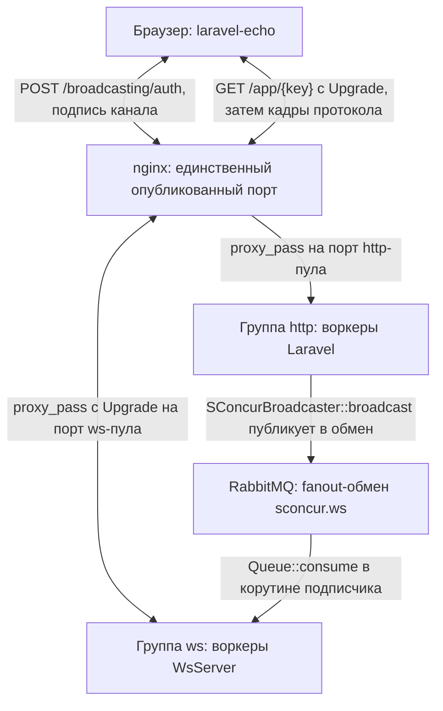
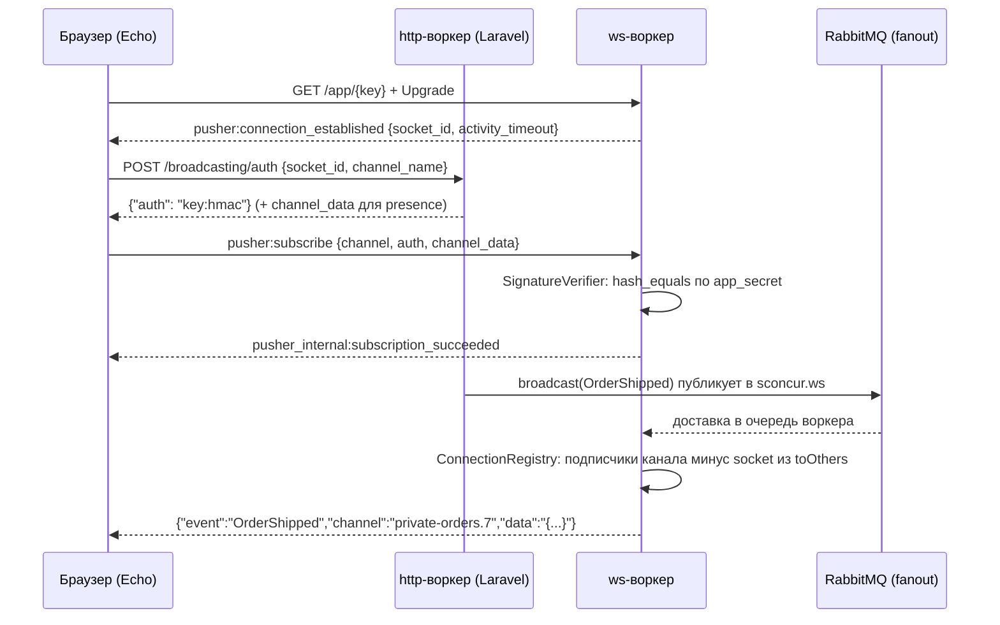

[English](websocket.md) | Русский

# WebSocket-пул

Четвёртая среда выполнения пакета, рядом с HTTP-сервером, пулом консьюмеров RabbitMQ и
пулом периодических задач: та же группа мастера, тот же `config/sconcur.php`, та же
телеметрия. Со стороны приложения это обычное вещание Laravel
(`broadcast(new OrderShipped($order))`), со стороны браузера — обычный `laravel-echo`.

## Оглавление

- [Что где живёт](#что-где-живёт)
- [Топология](#топология)
- [Примеры](#примеры)
- [Протокол](#протокол)
- [Каналы и подписи](#каналы-и-подписи)
- [Жизненный цикл клиента](#жизненный-цикл-клиента)
- [Шина](#шина)
- [Жизнь корутины-подписчика](#жизнь-корутины-подписчика)
- [Presence-каналы](#presence-каналы)
- [Конфигурация](#конфигурация)
- [Ограничения](#ограничения)

## Что где живёт

`SConcur\Features\WsServer\WsServer` из библиотеки держит слушатель и рукопожатие в
расширении и отдаёт каждое поднятое соединение в PHP, в своей корутине. Всё остальное —
здесь:

| Задача | Где |
|---|---|
| Кадры протокола | `src/Ws/Protocol/` |
| Проверка подписи канала | `src/Ws/Auth/SignatureVerifier.php` |
| Соединения и подписки процесса | `src/Ws/ConnectionRegistry.php` |
| Цикл одного клиента | `src/Ws/ConnectionHandler.php` |
| Доставка между процессами | `src/Ws/Bus/` |
| Список участников presence-канала | `src/Ws/Presence/` |
| Драйвер вещания Laravel | `src/Ws/Broadcasting/SConcurBroadcaster.php` |
| Запуск воркера | `src/Ws/WsServerRunner.php`, `src/Console/WsStartCommand.php` |

## Топология



Пул консьюмеров и пул задач публикуют в ту же шину тем же драйвером — на схеме опущены,
чтобы не дублировать одну стрелку трижды.

## Примеры

Примеры рассчитаны на `laravel-echo` 2.4.0 и `pusher-js` 8.6.0.

### Что включить в приложении

```php
// config/broadcasting.php
'connections' => [
    'sconcur' => ['driver' => 'sconcur'],
],
```

```dotenv
BROADCAST_CONNECTION=sconcur

SCONCUR_WS_WORKER_COUNT=2
SCONCUR_WS_APP_KEY=some-public-key
SCONCUR_WS_APP_SECRET=some-private-secret
```

Ключ и секрет больше нигде не дублируются: драйвер вещания, обработчик соединения и
путь группы читают их из `config('sconcur.ws')`.

```js
// resources/js/echo.js — ничего своего, обычный pusher-клиент
window.Echo = new Echo({
    broadcaster: 'pusher',
    key: import.meta.env.VITE_SCONCUR_WS_KEY,
    wsHost: window.location.hostname,
    wsPort: 80,
    forceTLS: false,
    disableStats: true,
    enabledTransports: ['ws', 'wss'],
    cluster: '',
});
```

### Публичный канал

```php
namespace App\Events;

use Illuminate\Broadcasting\Channel;
use Illuminate\Contracts\Broadcasting\ShouldBroadcast;
use Illuminate\Foundation\Events\Dispatchable;

class OrderShipped implements ShouldBroadcast
{
    use Dispatchable;

    public function __construct(public readonly int $orderId)
    {
    }

    /**
     * @return list<Channel>
     */
    public function broadcastOn(): array
    {
        return [new Channel('orders')];
    }

    public function broadcastAs(): string
    {
        return 'order.shipped';
    }

    /**
     * @return array<string, mixed>
     */
    public function broadcastWith(): array
    {
        return ['id' => $this->orderId];
    }
}
```

```php
OrderShipped::dispatch($order->id);
```

```js
Echo.channel('orders').listen('.order.shipped', (payload) => console.log(payload.id));
```

Точка перед именем обязательна, когда событие объявляет `broadcastAs()`: без неё Echo
подставит свой namespace `App.Events`. Это правило Echo, а не пула.

`ShouldBroadcast` отправляет через очередь, `ShouldBroadcastNow` — сразу в том же
процессе. Для пула разницы нет: в обоих случаях публикует один и тот же драйвер.

### Приватный канал

```php
// routes/channels.php
Broadcast::channel('orders.{orderId}', function (User $user, int $orderId): bool {
    return Order::whereKey($orderId)->whereBelongsTo($user)->exists();
});
```

```php
public function broadcastOn(): array
{
    return [new PrivateChannel('orders.' . $this->orderId)];
}
```

```js
Echo.private(`orders.${orderId}`).listen('.order.shipped', (payload) => { /* … */ });
```

Echo сам сходит на `/broadcasting/auth` вашего приложения, там отработают колбэки
`routes/channels.php`, и в ответ уйдёт подпись. Ws-воркер только проверит её — ни базы,
ни сессии на его стороне нет.

### Presence-канал

```php
// routes/channels.php — возвращаем данные участника, а не bool
Broadcast::channel('room.{roomId}', function (User $user, int $roomId): ?array {
    return $user->canJoin($roomId)
        ? ['id' => $user->id, 'name' => $user->name]
        : null;
});
```

```php
public function broadcastOn(): array
{
    return [new PresenceChannel('room.' . $this->roomId)];
}
```

```js
Echo.join(`room.${roomId}`)
    .here((members) => console.log('уже здесь:', members))
    .joining((member) => console.log('пришёл:', member.name))
    .leaving((member) => console.log('ушёл:', member.name))
    .listen('.message.posted', (payload) => { /* … */ });
```

`here()` приходит внутри ответа на подписку и потому содержит весь список сразу — при
нескольких воркерах он собирается из общего хранилища, см.
[Presence-каналы](#presence-каналы).

Один человек с двумя вкладками — один участник: `joining()` на вторую вкладку не
придёт, `leaving()` — только когда закроется последняя.

### Не отправлять инициатору

```php
use Illuminate\Broadcasting\InteractsWithSockets;

class OrderShipped implements ShouldBroadcast
{
    use Dispatchable;
    use InteractsWithSockets;
```

```php
broadcast(new OrderShipped($order->id))->toOthers();
```

Без трейта `InteractsWithSockets` вызов `toOthers()` не делает ничего и не жалуется:
socket id писать некуда, и в сообщение он не попадёт.

Echo проставляет заголовок `X-Socket-ID` сам — но только тем клиентам, в которые
встраивается: axios, jQuery, Vue Resource, Turbo. Если запрос уходит через `fetch`,
заголовок нужно поставить руками:

```js
fetch('/api/orders/42/ship', {
    method: 'POST',
    headers: {'X-Socket-ID': Echo.socketId()},
});
```

### Клиентские события

Один подписчик говорит другим, минуя приложение. Выключены по умолчанию, как и у Pusher:

```dotenv
SCONCUR_WS_CLIENT_EVENTS=true
SCONCUR_WS_CLIENT_EVENTS_PER_MINUTE=60
```

```js
Echo.private(`orders.${orderId}`)
    .listenForWhisper('typing', (payload) => console.log(payload.name, 'печатает'))
    .whisper('typing', {name: 'Ann'});
```

Работает только на `private-` и `presence-` каналах, и только для тех, кто на канал
подписан. Автору событие не возвращается. Ограничение частоты считается на соединение:
исчерпав его, клиент молча перестаёт быть слышен до следующей минуты.

### Вещание не только из HTTP

Драйвер один и тот же, откуда бы его ни позвали — важно лишь то, что публикует он в
шину, а не в память процесса:

```php
class NotifyShipment implements ShouldQueue
{
    public function handle(): void
    {
        broadcast(new OrderShipped($this->orderId));
    }
}
```

```php
class ReportTask implements TaskInterface
{
    public function tick(): TickResultEnum
    {
        broadcast(new StatsUpdated($this->collect()));

        return TickResultEnum::Worked;
    }
}
```

### События самого пула

Пул поднимает обычные события Laravel — по ним удобно считать подключения или писать
журнал:

```php
use SConcur\Laravel\Ws\Events\ChannelSubscribed;
use SConcur\Laravel\Ws\Events\ClientEventReceived;
use SConcur\Laravel\Ws\Events\ConnectionClosed;
use SConcur\Laravel\Ws\Events\ConnectionOpened;

Event::listen(ConnectionOpened::class, function (ConnectionOpened $event): void {
    Log::info('ws opened', ['socket' => $event->socketId, 'from' => $event->remoteAddr]);
});
```

Слушатель выполняется в ws-воркере, в корутине этого соединения. Всё, что он делает
блокирующе, останавливает весь воркер — писать в базу оттуда синхронным драйвером не
стоит.

### Фронт на отдельном origin

Со стороны сервера ничего не меняется: подходит любой SPA, лишь бы он говорил на этом
протоколе. `laravel-echo` и `pusher-js` поставляются с типами (`dist/echo.d.ts`), так что
на TypeScript это выглядит так:

```ts
// composables/useEcho.ts
import Echo from 'laravel-echo'
import Pusher from 'pusher-js'

export const echo = new Echo<'pusher'>({
    broadcaster: 'pusher',
    Pusher,
    key: import.meta.env.VITE_SCONCUR_WS_KEY,
    // Хост API, а не хост фронта: сокет идёт туда же, куда и остальные запросы.
    wsHost: import.meta.env.VITE_API_HOST,
    wsPort: 80,
    forceTLS: false,
    disableStats: true,
    enabledTransports: ['ws', 'wss'],
    cluster: '',
    authEndpoint: `${import.meta.env.VITE_API_URL}/broadcasting/auth`,
    bearerToken: localStorage.getItem('token'),
})
```

Три вещи, на которых спотыкаются:

1. **Само подключение к сокету CORS не касается** — рукопожатие не проходит preflight, и
   браузер не спрашивает разрешения. Проверку `allowedOrigins` пул серверу не передаёт:
   это массив, а `WsServer::fromArgs` разбирает только скаляры. То есть открыть
   соединение может кто угодно откуда угодно, и защищает не origin, а подпись канала.
   Нужен барьер на самом подключении — это firewall или nginx, не пул.
2. **А `/broadcasting/auth` — обычный кросс-доменный POST**, и вот ему нужны и CORS, и
   способ узнать пользователя. Либо сессия Sanctum с `withCredentials`, либо токен: у
   Echo для этого есть `bearerToken` и `auth.headers`, он сам подставит заголовок
   `Authorization`. Публичные каналы этого маршрута не касаются вовсе.
3. **`wsHost` указывает на хост API.** Nginx там должен пропускать Upgrade на
   `/app/` — тот самый отдельный `location`, что и для монолита.

### Клиент без Echo

Echo обязательным не является: протокол описан выше целиком, и демо-страница этого
репозитория говорит на нём голым `WebSocket` — без сборки, без зависимостей. Порядок
кадров тот же:

```ts
const socket = new WebSocket(`wss://${host}/app/${key}?protocol=7`)

socket.onmessage = (message) => {
    const frame = JSON.parse(message.data)
    // `data` — строка с JSON внутри, в обе стороны. Это протокол, а не случайность.
    const data = typeof frame.data === 'string' ? JSON.parse(frame.data || '{}') : frame.data

    if (frame.event === 'pusher:connection_established') {
        socket.send(JSON.stringify({event: 'pusher:subscribe', data: {channel: 'orders'}}))
    }

    if (frame.event === 'pusher:ping') {
        socket.send(JSON.stringify({event: 'pusher:pong', data: {}}))
    }
}
```

Для приватного канала в `pusher:subscribe` добавляется `auth`, полученный от
`/broadcasting/auth`, для presence — ещё и `channel_data` оттуда же.

### Публикация не из Laravel

Шина — обычный fanout-обмен, поэтому положить в неё сообщение может любой сервис,
умеющий AMQP. Тело — плоский JSON:

```json
{
  "channels": ["private-orders.7"],
  "event": "OrderShipped",
  "data": "{\"id\":7}",
  "socket": null
}
```

`data` — строка с JSON внутри, ровно та, что уйдёт клиенту: воркеры её не разбирают.
`socket` — соединение, которому доставлять не надо (аналог `toOthers()`); ключа может не
быть вовсе. Сообщение, которое не разбирается, воркер молча пропускает — шина общая, и
чужой кадр не должен его ронять.

За Laravel остаётся ровно одно: выдача подписи на приватный и presence-канал, потому что
она считается по правилам доступа приложения.

### Если ничего не приходит

По порядку, сверху вниз:

1. `sconcur:servers:master:status` показывает группу `ws`? Меньше одного воркера —
   группы в конфиге нет вовсе.
2. `sconcur:extension:status` — версия расширения совпадает с версией пакета?
3. Клиент вообще подключился? Чужой ключ в пути даёт `404` на рукопожатии, и до PHP
   дело не доходит: сравните `SCONCUR_WS_APP_KEY` с тем, что в `key` у Echo.
4. nginx пропускает Upgrade на этом пути? Нужен отдельный `location` с
   `proxy_set_header Upgrade` и большим `proxy_read_timeout` — блок с обычными
   таймаутами рвёт соединение раз в минуту.
5. Подписка прошла? На отказ приходит `pusher:subscription_error`, и Echo отдаёт его в
   `.error()`. Чаще всего это несошедшаяся подпись — секрет в http-воркере и в
   ws-воркере должен быть один. Если фронт на отдельном origin, смотрите ещё и на
   `/broadcasting/auth`: сокет открывается без CORS, а этот запрос — нет, и его
   отклонённый preflight выглядит как молчащий приватный канал.
6. Событие ушло в шину? Обмен `sconcur.ws` виден в панели RabbitMQ, а привязанных к
   нему очередей — по одной на каждый ws-воркер, у которого есть хотя бы одно
   соединение. У простаивающего воркера очереди нет: подписчик уходит вместе с
   последним клиентом.
7. Первое событие сразу после первого подключения может не дойти. Подписчик шины
   поднимается вместе с первым соединением, и пока он не привязал свою очередь, fanout
   выбрасывает сообщение — адресатов у обмена ещё нет. Окно — десятки миллисекунд, и
   касается только воркера, который до этого простаивал.
8. Дошло всем, кроме отправителя? Так и задумано, если вызывали `toOthers()`.

## Протокол

Совместимое подмножество Pusher v7. Благодаря этому `laravel-echo` работает без своего
клиента, а авторизация канала идёт через штатный маршрут приложения
`/broadcasting/auth`.

Одно правило, на котором держится всё остальное: поле `data` едет строкой с JSON внутри,
а не вложенным объектом. Так делают обе стороны, и кадр с вложенным объектом клиент
молча выбрасывает.

### Сервер → клиент

| Событие | Когда |
|---|---|
| `pusher:connection_established` | сразу после Upgrade; `data` несёт `socket_id` и `activity_timeout` |
| `pusher_internal:subscription_succeeded` | подписка принята; для presence — блок `presence` |
| `pusher:pong` | ответ на `pusher:ping` |
| `pusher:error` | соединение отвергнуто; за ним следует закрытие |
| `pusher:subscription_error` | отказ по одному каналу; соединение остаётся |
| `pusher_internal:member_added` / `member_removed` | presence-канал |
| прикладное событие | доставка из шины |

### Клиент → сервер

| Событие | `data` |
|---|---|
| `pusher:subscribe` | `channel`, `auth`, `channel_data` |
| `pusher:unsubscribe` | `channel` |
| `pusher:ping` | `{}` |
| `client-*` | произвольная нагрузка, только private/presence и только при включённой опции |

Всё, что не разобралось или не входит в список, игнорируется: клиент новее сервера не
должен терять из-за этого соединение.

### Коды ошибок

Диапазон важнее номера — от него зависит, будет ли клиент переподключаться:
`4000–4099` — не переподключаться, `4100–4199` — с паузой, `4200–4299` — сразу.

| Код | Когда |
|---|---|
| `4001` | ключ приложения в пути не тот |
| `4009` | подпись не сошлась, приватный канал без `auth`, шифрованный канал |
| `4100` | превышен лимит каналов на соединение |

## Каналы и подписи

| Префикс | Тип | Что требуется |
|---|---|---|
| нет | публичный | ничего |
| `private-` | приватный | подпись |
| `presence-` | presence | подпись и `channel_data` |
| `private-encrypted-` | шифрованный | не поддерживается, отвечаем `pusher:subscription_error` |

Ws-воркер не ходит ни в базу, ни в сессию: право на канал подтверждает подпись, которую
выдал http-воркер.

```
signature = hash_hmac('sha256', "{socket_id}:{channel}", app_secret)
auth      = "{app_key}:{signature}"
```

Для presence в подписываемую строку добавляется третьим сегментом строка `channel_data` —
без этого клиент мог бы переписать, кем он представляется, по дороге к ws-воркеру.
Проверка — `hash_equals`.

Обе стороны этой подписи живут в пакете: `SConcurBroadcaster::validAuthenticationResponse`
выдаёт, `SignatureVerifier::verify` проверяет. Тест `BroadcasterTest` замыкает петлю
между ними — именно её ломает любая правка формата.

## Жизненный цикл клиента



## Шина

Событие поднимается в http-воркере, в консьюмере очереди или в задаче, а соединения живут
в ws-воркерах. `Connection::write` эту границу не пересекает — расширение маршрутизирует
запись по `id` внутри своего процесса.

HTTP-API в самом ws-сервере, как у Reverb, здесь невозможен: ws-сервер не обслуживает
прикладных маршрутов (всё, что не Upgrade, получает `426`), а под `SO_REUSEPORT` у
отдельного воркера нет своего адреса — соединения раздаёт ядро. Поэтому доставка идёт
через fanout-обмен RabbitMQ, а `Queue::consume()` из библиотеки — генератор,
приостанавливающий корутину, то есть встраивается в цикл сервера без единого
блокирующего вызова.

У каждого ws-воркера своя очередь: имя выдаёт брокер, флаги `exclusive: true`,
`autoDelete: false`, `durable: false`.

**`autoDelete` обязан быть выключен.** Подписчик выходит из генератора `consume()` на
каждом простое, чтобы проверить реестр, а выход отменяет потребителя. С `autoDelete`
брокер сносит очередь как оставшуюся без потребителей, и следующий `consume()` получает
`404 NOT_FOUND`, который заодно убивает канал. `exclusive` даёт ту же продолжительность
жизни, но привязывает её к соединению: умер воркер — ушла очередь.

Доставки подтверждаются автоматически (`autoAck`). Вещание — уведомление, а не задание:
воркер, который на секунду отвалился, должен пропустить событие, а не получить пачку
через минуту. Приложению, которому нужны гарантии, нужна очередь, а не вещание.

Драйвер `local` (`SCONCUR_WS_BUS_DRIVER=local`) не доставляет ничего между процессами и
годится только для тестов.

## Жизнь корутины-подписчика

Единственное неочевидное место реализации.

`Scheduler::serve` при остановке перестаёт принимать соединения и ждёт, пока не завершатся
все порождённые корутины. Вечная корутина-подписчик этот счётчик никогда не отпустит, и
graceful stop превратится в ожидание до `shutdownTimeoutMs` с `SIGKILL` в конце.
Диагностика простоя прямо называет корутину, которую ждёт планировщик.

Поэтому подписчик живёт ровно столько, сколько есть кому доставлять:

- первое соединение поднимает его через `Scheduler::get()->spawn()`;
- между доставками он смотрит на реестр и, найдя его пустым, выходит;
- при остановке расширение закрывает соединения, `read()` возвращает `null`, обработчики
  возвращаются, реестр пустеет — и подписчик уходит сам.

Чтобы «между доставками» наступало и на молчащей шине, соединение подписчика к брокеру
открывается со своим `readTimeoutSeconds`: истёкшее ожидание поднимает `QueueException`
(«Consumer timeout exceed»), что для генератора — простой, а не конец. Ловим, проверяем
реестр, переоткрываем потребителя.

Отсюда цена: задержка graceful stop не больше `readTimeoutSeconds` плюс двухсекундная
пауза, которую расширение даёт push-only соединениям. Поэтому
`SCONCUR_WS_BUS_READ_TIMEOUT_SECONDS` обязан оставаться заметно меньше
`shutdownTimeoutMs` группы.

Ошибка канала лечится переоткрытием канала, а не только потребителя: канал умирает
вместе с ошибкой, и очередь на нём — тоже.

## Presence-каналы

Список участников — единственное состояние ws-пула, которое не помещается в один процесс:
ядро раздаёт соединения по воркерам, и список, собранный одним из них, не неполный, а
неверный.

Разделение: снимок берётся из общего хранилища, изменения едут по шине.

- `PresenceRepositoryInterface` — `join`/`leave`/`members`.
- `MemoryPresenceRepository` — верен ровно при одном воркере.
- `CachePresenceRepository` — карта `socketId => участник` под одним ключом на канал,
  запись под `Cache::lock`, TTL продлевается при каждом изменении (это же и уборка за
  воркером, убитым `SIGKILL`).
- `store: auto` выбирает по размеру пула: `memory` при одном воркере, `cache` при
  нескольких. Явный `memory` при пуле больше одного воркера — предупреждение команды
  старта, а не молчаливое согласие.

Хранилище считает участников по соединениям, протокол — по пользователям: один человек с
двумя вкладками это один участник. `PresencePayload` их сворачивает и он же решает, стоит
ли объявлять приход и уход.

## Конфигурация

Группа `ws` в `config('sconcur.master.groups')` и секция `config('sconcur.ws')`.
Полный перечень ENV — в [configuration.ru.md](configuration.ru.md).

Два значения, которые нельзя выставить «как у http»:

| Параметр | Значение | Почему |
|---|---|---|
| `handlerTimeoutMs` | `0` | это дедлайн на всю жизнь соединения, а не на кадр: что угодно выше нуля рвёт всех клиентов по таймеру |
| `idleTimeoutMs` | `0` | молчание клиента нормально; живость держит `pingIntervalMs` |

`path` — точная строка `/app/{app_key}`. Query-строка в сравнение не входит, поэтому
`/app/{key}?protocol=7` совпадает, а чужой ключ получает `404` на рукопожатии, не поднимая
соединения. Пустая строка приняла бы любой путь — тогда ключ проверяет только обработчик.

## Ограничения

- TLS и сжатие `permessage-deflate` — нет: TLS терминирует nginx, сжатие расширение пока
  не умеет.
- HTTP-API Pusher (`/apps/{id}/events`), вебхуки, статистика — нет: их место заняла шина.
- Шифрованные каналы — нет, отвечаем явным отказом.
- Истории событий нет: переподключившийся клиент не получает пропущенное.
- Событие, отправленное в первые десятки миллисекунд после первого подключения к
  простаивавшему воркеру, может до него не дойти: подписчик шины поднимается вместе с
  этим соединением, а fanout выбрасывает сообщение, пока его очередь не привязана.
- `sconcur:servers:master:reload` рвёт ws-соединения. Для http-пула reload незаметен,
  здесь — заметен; Echo переподключается сам.
